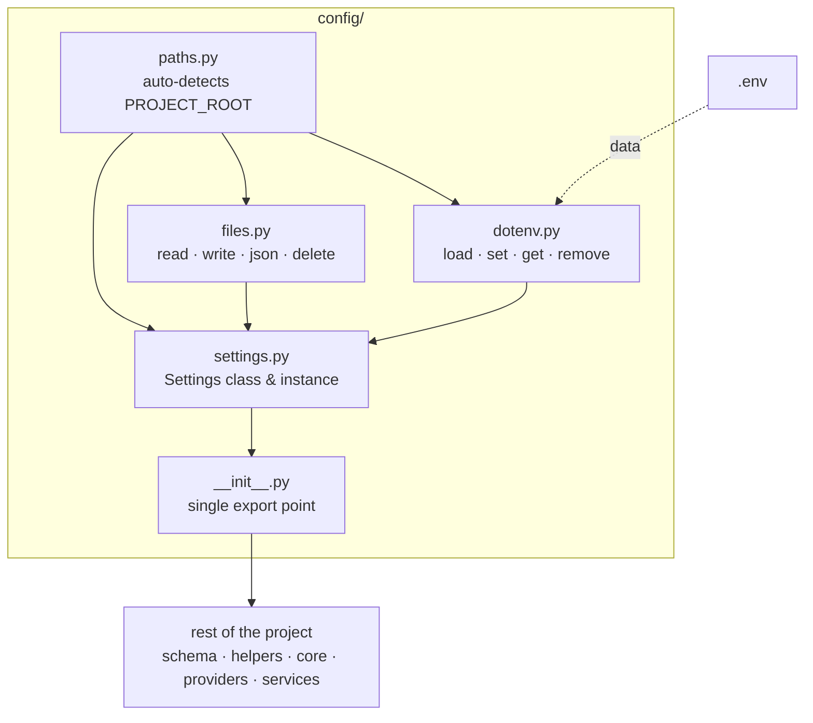

# Python Project Config
> *"Where eyes fail, structure becomes the light — and a blind man with a strong foundation walks further than a sighted man without one."*

## Core Rules
1. `config/` is **always copied whole** into every project — never modified
2. Project-specific fields go in `src/config/settings.py` — not the template
3. `paths.py` auto-detects `PROJECT_ROOT` via marker files — no hardcoding
4. `dotenv.py` uses `os.environ.setdefault` — never overwrites already-set vars
5. All path fields in `Settings` are resolved relative to `PROJECT_ROOT`

### Config Structure
```
config/
├── __init__.py       ← auto-loads dotenv, exports EVERYTHING
├── paths.py          ← PROJECT_ROOT auto-detection
├── files.py          ← read/write/json/delete utilities
├── dotenv.py         ← load/set/get/remove .env values
├── settings.py       ← Settings class and instance
├── logger.py         ← Unified Rotating Logger setup
└── .env.example      ← universal template
```

### Internal Flow



---
## SetConfig
> *"One command. Zero boilerplate."*

Instead of manually creating each config file, use the `setconfig` tool to instantly scaffold the entire `src/config/` layer into any project.

### How to use?

#### 1. Fresh project (safe mode — skips existing files)
```bash
human-skills '{
    "tool_name": "setconfig",
    "tool_args": {
        "destination": "/path/to/your_project/src/config"
    }
}'
```

#### 2. Force overwrite existing files
```bash
human-skills '{
    "tool_name": "setconfig",
    "tool_args": {
        "destination": "/path/to/your_project/src/config",
        "override": "true"
    }
}'
```

### What it creates?
```
src/config/
├── __init__.py    ← auto-loads dotenv, exports everything
├── paths.py       ← PROJECT_ROOT auto-detection
├── files.py       ← centralized I/O utilities
├── dotenv.py      ← safe env loading
├── settings.py    ← minimal Pydantic settings (edit for your project)
└── logger.py      ← standardized rotating logger
```

> After scaffolding: add project-specific fields to `settings.py` and fill in `.env` from `.env.example`.

---

## Architecture Auditing (Linter)
> *"Trust, but verify."*

To ensure your project remains compliant with these standards, use the built-in `linter` tool. It scans your code for violations of the architecture rules (logging, pathlib, print, etc.) using AST parsing.

### How to use?
Run the linter via `human-skills` command.

#### 1. Audit entire project 
```bash
human-skills '{
    "tool_name": "linter",
    "tool_args": {
        "scan_path": "/path/to/your/project",
        "ignored_path": "venv, .git, tests"
    }
}'
```

#### 2. Audit a specific file
```bash
human-skills '{
    "tool_name": "linter",
    "tool_args": {
        "scan_path": "/path/to/your/project/src/services/logic.py"
    }
}'
```

### What it detects?
- ❌ **Logging Violation**: Use of direct `import logging` (Must use `setup_logger`).
- ❌ **Pathlib Violation**: Use of `pathlib` outside `src/config/`.
- ❌ **Manual Dir Creation**: Use of `exist_ok=True` (Must use `ensure_dir`).
- ❌ **Silent Exception**: Use of `except: pass` (Swallowing errors).
- ⚠️ **Print Statements**: Use of `print()` in production-ready code.
- ❌ **Env Access**: Use of `os.environ` or `os.getenv` (Must use `Settings`).
- ❌ **Logger Compliance**: Hardcoded log filenames in `setup_logger`.

---

## Checklist When Setting Up a New Project

- [ ] Copy the `config/` folder into `src/config/`
- [ ] Copy `root/.env.example` to `root/.env` and fill in mandatory fields
- [ ] Ensure `src/config/settings.py` contains all project-specific fields
- [ ] Use `from src.config import Settings` anywhere in the project