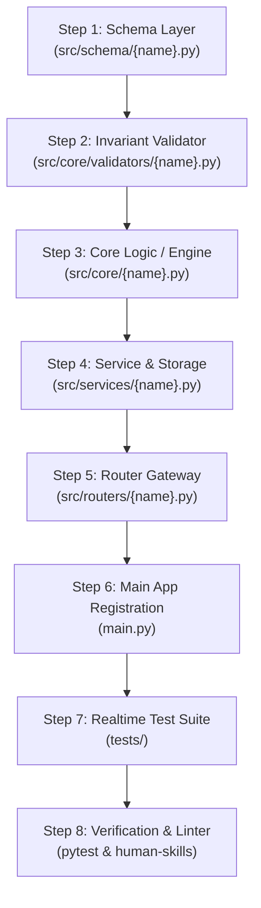

# Strict Type-Safe & Validation-Based Architecture Development Formula

## 1. The Canonical 8-Step Development Sequence



---

## 2. Universal Architectural Rules

Before writing code for any implementation, verify strict adherence to the project's permanent architectural rules:

1. **Clean Code & Token Efficiency (Rule 10)**:
   - Zero inline comments and zero docstrings inside implementation code.
   - Self-describing types, function names, and variable names only.
2. **Fail-at-Fast & Zero-Fallback (Rule 9)**:
   - No compatibility hacks or backward aliases.
   - No default fallback parameters (`"default"`, `""`, `**kwargs`) masking missing required arguments.
   - Missing or malformed data MUST fail immediately at the boundary.
3. **Encapsulation & Dependency Injection**:
   - Never mutate module-level global state. Encapsulate business state inside class instances and inject dependencies via constructors.
4. **Zero-Trust Router Security & Identity Verification**:
   - Never trust client-supplied boolean auth flags (`is_auth`, `is_admin`) or client-provided `user_id`.
   - All protected router endpoints must enforce server-side cryptographic authentication guards (`Depends(get_current_user)`).
   - Prevent IDOR by scoping data access and storage strictly to the authenticated `user_id`.

---

## 3. Step-by-Step Implementation Formula

### Step 1: Schema Layer (`src/schema/{name}.py`)
> **Objective**: Define strict input and output data contracts before writing any implementation code. Zero fallback, zero silent bypass.

```python
from pydantic import BaseModel, Field

class Item(BaseModel):
    item_id: str = Field(..., pattern=r"^itm_[a-zA-Z0-9_-]+$")

class CustomOutput(BaseModel):
    content_id: str = Field(..., pattern=r"^cnt_[a-zA-Z0-9_-]+$")
    items: list[Item] = Field(min_length=1)
```

Export from [src/schema/__init__.py](file:///home/naimul/human-skills/src/schema/__init__.py):
```python
from .name import Item, CustomOutput
```

---

### Step 2: Domain Invariant Validator (`src/core/validators/{name}.py`)
> **Objective**: Enforce domain-specific business invariants beyond static schema constraints.

```python
from src.schema import CustomOutput

class CustomValidator:
    def validate(self, plan: CustomOutput) -> tuple[bool, list[str]]:
        errors, seen = [], set()
        for item in plan.items:
            if item.item_id in seen:
                errors.append(f"Duplicate item_id: {item.item_id}")
            seen.add(item.item_id)
        return len(errors) == 0, errors
```

Export from [src/core/validators/__init__.py](file:///home/naimul/human-skills/src/core/validators/__init__.py):
```python
from .name import CustomValidator
```

---

### Step 3: Core Engine & Business Logic (`src/core/{name}.py`)
> **Objective**: Implement the pure domain execution engine with event loop closure prevention.

```python
import asyncio
import concurrent.futures
from src.config import Settings, setup_logger
from src.schema import CustomOutput, Item

logger = setup_logger(Settings.LOG_DIR / "core.log", name="app.core.engine")

class CustomEngine:
    async def run_async(self, content_id: str, instructions: str) -> CustomOutput:
        logger.info(f"Engine running for {content_id}")
        return CustomOutput(content_id=content_id, items=[Item(item_id="itm_1")])

    def run(self, content_id: str, instructions: str) -> CustomOutput:
        coro = self.run_async(content_id, instructions)
        try:
            if asyncio.get_running_loop().is_running():
                with concurrent.futures.ThreadPoolExecutor(max_workers=1) as ex:
                    return ex.submit(asyncio.run, coro).result()
        except RuntimeError:
            pass
        return asyncio.run(coro)
```

Export from [src/core/__init__.py](file:///home/naimul/human-skills/src/core/__init__.py):
```python
from .name import CustomEngine
```

---

### Step 4: Service & Storage Repository (`src/services/{name}.py`)
> **Objective**: Orchestrate data processing, invariant validation, and filesystem persistence with path defense.

```python
import re
from typing import Optional
from src.config import Settings, setup_logger, read_json, write_json, exists
from src.schema import CustomOutput
from src.helpers import ValidationError, NotFoundError
from src.core import CustomEngine
from src.core.validators import CustomValidator

logger = setup_logger(Settings.LOG_DIR / "service.log", name="app.services.custom")
_SAFE_ID = re.compile(r"^[a-zA-Z0-9_-]+$")

class CustomRepository:
    def __init__(self, base_dir: str = "data/outputs"):
        self.base_dir = base_dir

    def _path(self, content_id: str) -> str:
        if not _SAFE_ID.match(content_id.strip()):
            raise ValidationError(f"Invalid id: '{content_id}'")
        return f"{self.base_dir}/{content_id}.json"

    def save(self, record: CustomOutput) -> None:
        write_json(self._path(record.content_id), record.model_dump())

    def get(self, content_id: str) -> CustomOutput:
        path = self._path(content_id)
        if not exists(path):
            raise NotFoundError(f"Not found: {content_id}")
        return CustomOutput.model_validate(read_json(path))

class CustomService:
    def __init__(
        self,
        repo: Optional[CustomRepository] = None,
        engine: Optional[CustomEngine] = None,
        validator: Optional[CustomValidator] = None,
    ):
        self.repo = repo or CustomRepository()
        self.engine = engine or CustomEngine()
        self.validator = validator or CustomValidator()

    async def execute_and_save(self, content_id: str, instructions: str) -> tuple[CustomOutput, bool, list[str]]:
        record = await self.engine.run_async(content_id, instructions)
        valid, errors = self.validator.validate(record)
        if valid:
            self.repo.save(record)
        return record, valid, errors

    def get_record(self, content_id: str) -> CustomOutput:
        return self.repo.get(content_id)
```

Export from [src/services/__init__.py](file:///home/naimul/human-skills/src/services/__init__.py):
```python
from .name import CustomRepository, CustomService
```

---

### Step 5: Router Gateway (`src/routers/{name}.py`)
> **Objective**: Expose strongly-typed REST endpoints with Pydantic validation and cryptographic auth guards.

> [!CAUTION]
> **Anti-Pattern Warning**: NEVER accept client-supplied auth flags (`is_auth`, `is_admin`) or unverified `user_id`. Always enforce server-side verified tokens (`Depends(get_current_user)`) and scope resources by `user.user_id` to block IDOR attacks.

```python
from fastapi import APIRouter, HTTPException, Depends, status
from pydantic import BaseModel, Field
from src.config import Settings, setup_logger
from src.schema import CustomOutput
from src.services import CustomService
from src.helpers import ValidationError, NotFoundError, get_current_user, UserContext

logger = setup_logger(Settings.LOG_DIR / "router.log", name="app.routers.custom")
router = APIRouter(prefix="/custom", tags=["Custom"])

class CustomRequest(BaseModel):
    content_id: str = Field(..., pattern=r"^cnt_[a-zA-Z0-9_-]+$")
    instructions: str = Field(..., min_length=1)

@router.post("/execute", response_model=CustomOutput, status_code=status.HTTP_201_CREATED)
async def execute(
    payload: CustomRequest,
    user: UserContext = Depends(get_current_user),
    service: CustomService = Depends(CustomService),
) -> CustomOutput:
    try:
        record, valid, errors = await service.execute_and_save(payload.content_id, payload.instructions)
        if not valid:
            raise HTTPException(status_code=422, detail=errors)
        return record
    except ValidationError as e:
        raise HTTPException(status_code=422, detail=str(e))
    except Exception as e:
        logger.error(f"Execution failed for {user.user_id}: {e}")
        raise HTTPException(status_code=500, detail="Internal processing error")

@router.get("/{content_id}", response_model=CustomOutput)
def get_output(
    content_id: str,
    user: UserContext = Depends(get_current_user),
    service: CustomService = Depends(CustomService),
) -> CustomOutput:
    try:
        return service.get_record(content_id)
    except NotFoundError as e:
        raise HTTPException(status_code=404, detail=str(e))
```

Export from [src/routers/__init__.py](file:///home/naimul/human-skills/src/routers/__init__.py):
```python
from .name import router as custom_router
```

---

### Step 6: Application Mount (`main.py`)
> **Objective**: Register the router onto the top-level FastAPI application.

```python
from fastapi import FastAPI
from src.routers import custom_router

app = FastAPI(title="Production API")
app.include_router(custom_router, prefix="/api/v1")
```

---

### Step 7: Comprehensive Test Suite (`tests/`)
> **Objective**: Validate domain invariants, path traversal defense, and endpoint authentication.

```python
import pytest
from fastapi.testclient import TestClient
from src.schema import CustomOutput, Item
from src.core.validators import CustomValidator
from src.services import CustomRepository
from src.helpers import ValidationError
from main import app

def test_validator_detects_duplicates():
    validator = CustomValidator()
    invalid_data = CustomOutput(content_id="cnt_1", items=[Item(item_id="itm_1"), Item(item_id="itm_1")])
    is_valid, errors = validator.validate(invalid_data)
    assert not is_valid and any("Duplicate" in e for e in errors)

def test_path_traversal_defense(tmp_path):
    repo = CustomRepository(base_dir=str(tmp_path))
    with pytest.raises(ValidationError):
        repo._path("../../etc/passwd")

def test_router_unauthorized_without_token():
    client = TestClient(app)
    assert client.post("/api/v1/custom/execute", json={"content_id": "cnt_1", "instructions": "run"}).status_code == 401
```

---

### Step 8: Verification & Architectural Audit

Execute pytest and the AST architectural linter:

```bash
pytest -v
human-skills '{"tool_name": "linter", "tool_args": {"scan_path": "src", "ignored_path": "venv, .git, tests"}}'
```
