<div align="center">



[](LICENSE)


</div>

---

## What is Human Skills

The internet is full of AI skill repositories. The problem, Most of them are **blind skills**, Let's pull and track only the favorite one.

---

### Core Concept: Upstream Tracking + Skill Forwarding

Many great skill repos exist in the open-source community. Instead of copying them manually or losing track of updates, Human Skills uses a **two-step pipeline**:

```
Upstream repo (someone else's skills)
    ↓  git pull (daily, automated)
Local upstream clone
    ↓  copy only the verified skill folders
skills/  ← your curated, human-verified collection
    ↓  git commit + push (automatic)
Your GitHub repo (always up to date)
```

You stay in control of **what gets promoted** into `skills/`. Everything else in the upstream stays there — you only forward what you've verified works.

#### Step 1 — Add your upstream repos

Edit `scripts/helpers/upstream.yaml`:

```yaml
upstreams:

  - name: claude-skills
    path: "{REPO_ROOT}/.claude-skills"
    url: "https://github.com/alirezarezvani/claude-skills.git"
    pull: true

  - name: everything-claude-code
    path: "{REPO_ROOT}/.everything-claude-code"
    url: "https://github.com/affaan-m/everything-claude-code.git"
    pull: true
```

Each entry defines an upstream repository. 
- **Auto-Clone:** If the `path` does not exist locally but a `url` is provided, the script will automatically run `git clone` to download it.
- **Auto-Pull:** The sync script will run `git pull` in each one every cycle.
- **Freeze Updates:** Set `pull: false` if you want to freeze an upstream at its current version and stop receiving automatic updates.

#### Step 2 — Define which skills to forward

Edit `scripts/helpers/path_forward.yaml`:

```yaml
# everything-claude-code
  - from: "{REPO_ROOT}/.everything-claude-code/skills/pytorch-patterns"
    to:   "{REPO_ROOT}/skills/pytorch-patterns"
    enabled: true

  - from: "{REPO_ROOT}/.everything-claude-code/skills/python-patterns"
    to:   "{REPO_ROOT}/skills/python-patterns"
    enabled: true

  - from: "{REPO_ROOT}/.everything-claude-code/skills/python-testing"
    to:   "{REPO_ROOT}/skills/python-testing"
    enabled: true

# ui-ux-pro-max-skill
  - from: "{REPO_ROOT}/.ui-ux-pro-max-skill/.claude/skills/ui-ux-pro-max"
    to: "{REPO_ROOT}/skills/ui-ux-pro-max" 
    enabled: true

  - from: "{REPO_ROOT}/.ui-ux-pro-max-skill/README.md"
    to: "{REPO_ROOT}/skills/ui-ux-pro-max"
    enabled: true

# Temporarily pause a forward:
  - from: /absolute/path/to/cloned/some-skill-repo/skills/unverified-skill
    to:   /absolute/path/to/human-skills/skills/unverified-skill
    enabled: false
```

> **Rule of thumb:** Only set `enabled: true` for skills you have personally run and verified. This is what makes it a *Human Skill*.
> 
> **Smart Forwarding:** The daemon supports forwarding both entire directories and individual files. It uses a **Wipe-Once Merge Strategy**: multiple rules can safely copy files into the same destination directory without accidentally overwriting each other.

#### Step 3 — Tune the schedule

Edit `scripts/helpers/automation.yaml`:

```yaml
schedule:
  run_at: "06:00"            # Daily at 6 AM — change to your preference
  interval_hours: 24         # Used if run_at is null
  poll_interval_seconds: 30  # How often to check for config file changes

git:
  auto_push: true
  branch: main
  commit_message: "sync: auto-update from upstream [{datetime}]"

logging:
  level: INFO
  log_file: /absolute/path/to/human-skills/scripts/logs/sync.log
```

#### Step 4 — Running the Sync Daemon

The sync script is designed to run **persistently inside a `screen` session** so it survives terminal closure.

```bash
# Start a named screen session
screen -S human-skills-sync

# Run the daemon
python3 /path/to/human-skills/scripts/sync.py

# Detach from screen (daemon keeps running in background)
# Press:  Ctrl+A, then D

# Reconnect at any time to check logs
screen -r human-skills-sync
```

On every sync cycle the daemon:

1. **Pulls** or clones all upstream repos
2. **Copies** the forwarded skill folders into `skills/`
3. **Commits** all changes with a dynamic timestamped message detailing exactly which upstreams were updated (e.g. `sync: auto-update from upstream ui-ux-pro-max-skill 2026-04-17`)
4. **Pushes** to your remote repository automatically

---

## Quick Start: Use This Repo As-Is

```bash
# Clone the repo
git clone https://github.com/mdnaimul22/human-skills.git
cd human-skills

# Install sync script dependencies
pip install -r scripts/requirements.txt
```

To allow any assistance or user to execute skills globally from **any location** on your machine, use scripts/install.sh wrapper.

```bash
# Make the install script executable
chmod +x scripts/install.sh

# Run the installer
./scripts/install.sh
```

This automatically binds the `human-skills` command to your environment (`~/.local/bin`), so you no longer needs to use absolute python paths.

Example usages from any directory:
```bash
human-skills --list
human-skills --skill_info directory-structure
human-skills --tool_info tree_gen
human-skills '{"tool_name": "tree_gen", "tool_args": {"input_path": "/path"}}'
```

Finally Point your AI assistant's skill loader at the `skills/` directory.

---

### Distributing Agent Rules

If you have multiple projects and want to keep their `.agent/rules` in sync with this repository, you can use the following one-liner. Running this command in any project directory will create (or update) the `.agent/rules` folder with the latest standards from this repo:

```bash
curl -sSL https://raw.githubusercontent.com/mdnaimul22/human-skills/main/scripts/sync-rules.sh | bash
```

---

### Bootstrap New Project

To quickly scaffold a new project with our standard directory structure and the latest agent rules, run the following command in your new project directory:

```bash
curl -sSL https://raw.githubusercontent.com/mdnaimul22/human-skills/main/scripts/bootstrap.sh | bash
```

---

### What Makes a Skill "Human-Verified"?

A skill qualifies for this repo when:

- [x] You have used it in a **real task** (not just read it)
- [x] The AI followed its instructions and **produced correct output**
- [x] You ran it **more than once** with consistent results
- [x] You are confident recommending it to others

Blind skills — instruction files that look good on paper but have never been tested — are explicitly excluded.

---

### Repository Structure

```
human-skills/
├── skills/                         # ✅ Human-verified skills live here
│   ├── directory-structure/
│   ├── manage_project/
│   ├── openevolve-evolutionary-coding/
│   ├── zram-optimizer/
│   └── ...
│
├── scripts/
│   ├── sync.py                     # Automated upstream sync daemon
│   ├── requirements.txt
│   └── helpers/
│       ├── upstream.yaml           # Which repos to pull from daily
│       ├── path_forward.yaml       # Which skills to copy into skills/
│       └── automation.yaml         # Schedule, git, and logging settings
│
├── .claude-skills/                 # Upstream repos (git submodules / clones)
├── .everything-claude-code/
└── .superpowers/
```

### Contributing

If you want to contribute a skill:

1. Run the skill on a real task
2. Verify the output is correct
3. Run it again to confirm consistency
4. Submit a PR with the skill folder and a brief note on what you tested

Skills submitted without evidence of testing will not be merged.

---

### License

MIT — see [LICENSE](LICENSE).
