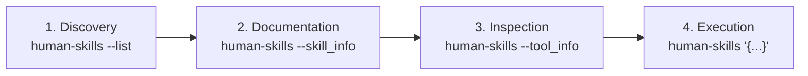

# Human Skills — Unified Dispatcher & Command Center

> *"You are a Dispatcher First, Executor Second. Execution of any task without first verifying and reading available skills is a critical failure."*

---

## 1. Overview & System Philosophy

`human-skills` is a centralized knowledge and tool execution engine containing **375+ specialized skills** organized into domain-specific storage namespaces, alongside **standalone executable CLI tools**.

### Mandatory AI Assistant Protocol:
1. **Never Hallucinate or Guess Inputs**: When a domain task arises (e.g., directory mapping, architecture linting, requirement generation, UI scaffolding), check for an existing skill or tool before writing manual code.
2. **Read Skill Docs First**: Always inspect `SKILL.md` via `human-skills --skill_info {skill_name}` before formulating an execution plan.
3. **Inspect Tool Schema**: Call `human-skills --tool_info {tool_name}` to get the exact JSON argument specification before invoking any tool.
4. **Surrender to Skill Instructions**: Once a skill is loaded, execute the exact workflow and commands specified in that skill.

---

## 2. Command Center Reference

| Command | Purpose | Example |
|:---|:---|:---|
| `human-skills --list all` | List all 375+ skills across all categories and all discovered tools | `human-skills --list all` |
| `human-skills --list <category>` | List skills and tools inside a specific category | `human-skills --list my_skills` |
| `human-skills --skill_info <name>` | Read the full markdown documentation for any skill | `human-skills --skill_info tree_gen` |
| `human-skills --tool_info <name>` | Inspect JSON schema (name, description, arguments, instructions) | `human-skills --tool_info linter` |
| `human-skills '<json_payload>'` | Execute any registered tool programmatically | `human-skills '{"tool_name": "tree_gen", ...}'` |

---

## 3. Storage Categories Guide

Skills are categorized under `skills/storage/` in dedicated domain namespaces. You can scope queries to any directory:

| Category Directory | Domain / Focus | Key Skills & Tools Included |
|:---|:---|:---|
| **`my_skills`** | User-crafted skills, architecture linting, scaffolding, tree generation | `tree_gen`, `linter`, `gen-requirements`, `bootstrap`, `zram-optimizer`, `scaffold-ui`, `scaffold-config`, `scaffold-helpers` |
| **`antvis_chart-visualization-skills`** | AntV visualization, infographics, pivot tables, G2 charts | `antv-g2-chart-expert`, `antv-infographic-generator`, `antv-s2-pivot-table-expert`, `antv-t8-narrative-generator` |
| **`anthropics_skills`** | Official Anthropic productivity, design, testing, documents | `pdf`, `pptx`, `docx`, `xlsx`, `skill-creator`, `mcp-builder`, `webapp-testing`, `claude-api`, `theme-factory` |
| **`agent-zero_skills`** | Agent Zero plugins, multi-agent development, task scheduling | `a0-development`, `a0-create-agent`, `a0-create-plugin`, `a0-manage-plugin`, `scheduled-tasks` |
| **`higgsfield-ai_skills`** | AI 3D assets, video animation, brandkit generation | `higgsfield-brandkit`, `higgsfield-websites`, `higgsfield-video-explainer`, `higgsfield-soul-id` |
| **`nextlevelbuilder_ui-ux-pro-max`** | UI/UX design systems, Tailwind, Shadcn, presentations | `ui-ux-pro-max`, `ui-styling`, `design-system`, `slides`, `banner-design` |
| **`obra_ superpowers`** | Agentic workflows, TDD, code review, git worktrees | `test-driven-development`, `systematic-debugging`, `executing-plans`, `subagent-driven-development` |
| **`affaan-m_ECC`** | Full-stack patterns (Python, Rust, Go, Java, SpringBoot, etc.) | `pytorch-patterns`, `react-patterns`, `golang-patterns`, `rust-patterns`, `springboot-patterns`, `fastapi` |
| **`Fission-AI _OpenSpec`** | Specification lifecycle and change proposal engineering | `openspec-explore`, `openspec-propose`, `openspec-apply-change`, `openspec-verify-change` |

---

## 4. The 4-Step Execution Workflow



### Step 1: Discover & Triage
```bash
# Check all available skills in a category
human-skills --list my_skills
```

### Step 2: Read Skill Documentation
```bash
# Read comprehensive workflow guidelines before taking action
human-skills --skill_info architecture-auditing-linter
```

### Step 3: Inspect Tool Parameters
```bash
# Returns exact arguments and parameter types in JSON
human-skills --tool_info linter
```

### Step 4: Execute the Tool
```bash
# Invoke the tool with structured parameters
human-skills '{
  "tool_name": "linter",
  "tool_args": {
    "scan_path": "/home/user/my-project/src",
    "output_file": "audit_report.md"
  }
}'
```

---

## 5. Standalone Tool Execution Examples

### 🌳 Example 1: Generate Directory Structure (`tree_gen`)
```bash
human-skills '{
  "tool_name": "tree_gen",
  "tool_args": {
    "input_path": "/home/naimul/human-skills/src",
    "file_name": "structure",
    "max_depth": "4",
    "ignored_path": "node_modules, dist, __pycache__, .git, .venv, .env"
  }
}'
```

### 🔍 Example 2: Architecture Compliance Audit (`linter`)
```bash
human-skills '{
  "tool_name": "linter",
  "tool_args": {
    "scan_path": "/home/naimul/my-project",
    "ignored_path": "tests, venv, .git"
  }
}'
```

### 📦 Example 3: Generate Clean Requirements (`gen_requirements`)
```bash
human-skills '{
  "tool_name": "gen_requirements",
  "tool_args": {
    "project_path": "/home/naimul/my-project",
    "output_format": "requirements.txt",
    "overwrite": "true"
  }
}'
```

### ⚙️ Example 4: Scaffold Standard Config Layer (`setconfig`)
```bash
human-skills '{
  "tool_name": "setconfig",
  "tool_args": {
    "destination": "/home/naimul/my-project"
  }
}'
```

### 🚀 Example 5: Scaffold Universal Helpers (`sethelpers`)
```bash
human-skills '{
  "tool_name": "sethelpers",
  "tool_args": {
    "destination": "/home/naimul/my-project"
  }
}'
```

### ⚡ Example 6: Linux Z-RAM & Memory Optimization (`zram_optimizer`)
```bash
sudo human-skills '{
  "tool_name": "zram_optimizer",
  "tool_args": {
    "algorithm": "zstd",
    "priority": "100"
  }
}'
```

---

## 6. Pro-Tips & Best Practices

1. **Case-Insensitive Resolution**: Category, skill, and tool queries are automatically normalized (e.g. `human-skills --list Custom` or `human-skills --tool_info TREE_GEN` resolve seamlessly).
2. **Error Recovery**: If you query a non-existent category, the CLI displays an error alongside the full list of available categories to help you correct the command.
3. **JSON Argument Escaping**: When running `human-skills` from bash, enclose the JSON payload in single quotes `'...'` to prevent shell variable expansion.
4. **Exit Codes**: The CLI exits with code `0` on success and code `1` on error, allowing easy integration into automated pipelines and agent verification loops.