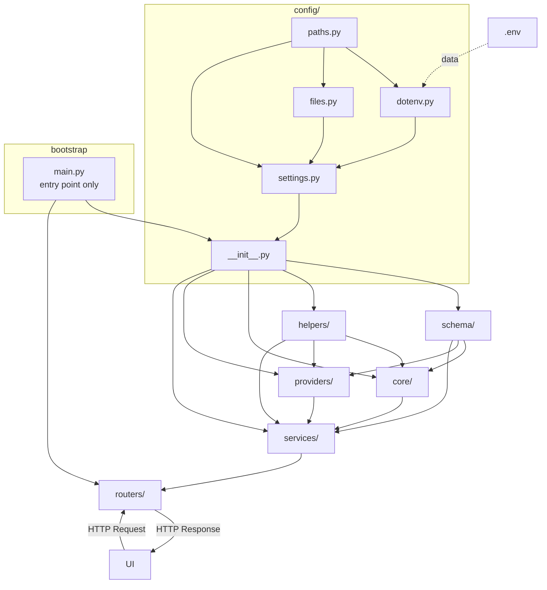

# Coding Standards

> *"We build scalable infrastructure, not just scripts. So The Structure is not an optional parameter — it's the foundation."*

You don't like messy Spaghetti code at all. The layout of the project will be **modern schema-based, lean & flat** — centered on `src/`. 

Where the responsibilities of each module like core, providers, tools, helpers and config will be clearly separated through the **Single Responsibility Principle (SRP)**.

> [!CAUTION]  
> ❌ Spaghetti code, God classes, and implicit dependencies are completely prohibited.

---

## 1. The Core Vision (Clean Architecture)

> [!NOTE]  
> *"Maintainable Code structure that reads like a premium framework."*

The code must look like it is part of a **solid, production-grade framework.**

- **Naming** — The purpose can be understood simply by reading the variable/function/class name.
- **DRY** — No duplication, utilize abstraction.
- **SOLID** — Always applicable.
- **No dead code** — Unused imports and stale variables are strictly prohibited.
- **Consistency** — Same pattern and same style must be maintained throughout the codebase.

> [!TIP]  
> 🎯 **Standard:** Any team member, senior or junior, should immediately understand what is happening, why it is happening, and where to extend it just by looking at the code.

---

## 2. Universal Dependency Flow

> *"Water never flows upward — imports always flow downward."*



**Import Permission Table:**

| Module | Can Import From | Blind To |
|:---|:---|:---|
| `config/` | `.env` (data only) | everything |
| `schema/` | `config/` | `core`, `providers`, `services`, `routers` |
| `helpers/` | `config/` | `core`, `providers`, `services`, `routers` |
| `core/` | `config/`, `schema/`, `helpers/` | `providers/`, `services/`, `routers/` |
| `providers/` | `config/`, `schema/`, `helpers/` | `core/`, `services/`, `routers/` |
| `services/` | `config/`, `schema/`, `helpers/`, `core/`, `providers/` | `routers/` |
| `routers/` | `services/`, `schema/` | `core/`, `providers/`, `helpers/` |
| `main.py` | `config/`, `routers/` | internal business logic |

---

## 3. The Structural Blueprint (Dependency & Directory Rules)

### 3.1 Dependency Rule
> *"Imports flow in one direction"*

The core rule of clean architecture is that imports should always be unidirectional to prevent circular dependencies. Correctly executing a Strict Dependency Rule exponentially increases the Scalability and Maintainability of a project.

#### 1. Top-level Isolation
Each folder in the project, such as `config`, `schema`, `api`, `browser`, `session`, `providers`, `tools`, `services`, will act as an independent module. None shall interfere with the internal affairs of another.

#### 2. Layer Trust / Unidirectional Flow

**The Core Truth:**
- `root/.env` is the Single Source of Truth for project environment variables. It manipulates `src/config/settings.py`. For example: `LOG_DIR=logs`, `JINA_API_KEY=abcd`
- `src/config/`:
  - `src/config/settings.py` is the gearbox of the entire project. The environment driver controls the project through this gearbox.  
    *(For example: `LOG_DIR: str = Field(default="logs", validation_alias="LOG_DIR")`, `@property \n def LOG_DIR(self) -> Path: \n return self._resolve_path(self.LOG_DIR)`)*
  - `src/config/dotenv.py`
  - `src/config/__init__.py`
- `src/schema/`: This directory holds the absolute truth for **Pydantic modeling** standards (`models.py`). It does not import or call any local modules; rather, the entire project depends on it.

**Dependency Privacy:**
- `src/{module}/helpers/`: Each module can have its own `helpers/` folder. These helpers are entirely private. Meaning, one module like `src/api/*` or `src/api/__init__.py` will never import or call the private helpers of another module like `src/{module}/helpers/*`. These `helpers` can only be called by their respective `src/{module}/*`.
- `src/helpers/`: If any global helper logic (e.g., date formatting, logging) is needed across multiple modules, it belongs in the project root `src/helpers/`. Everyone is allowed to import or call these globally.

**Core Infrastructures:**
- **`src/core/`**: Knows `src/schema/__init__.py`, `src/config/__init__.py`, and `src/helpers/`.
- **`src/providers/`**: Knows `src/schema/__init__.py`, `src/config/__init__.py`, and `src/helpers/`. Peer of `core/` — they are blind to each other.
- **`src/services/`**: The **fan-in point**. Knows `src/core/__init__.py`, `src/providers/__init__.py`, `src/schema/__init__.py`, `src/config/__init__.py`, and `src/helpers/`. This is where `core/` and `providers/` converge.
- **`src/routers/`**: Only knows `src/services/__init__.py` and `src/schema/__init__.py`. No business logic — HTTP interface only.
- **`src/api/frontend/`**: Merely used to represent `src/services/*` to the frontend.
- **`src/tools/`**: If tools are utilized to build a Model Context Server or Function Calling Interface for the agent, they act like a CLI interface that calls `src/services/*`. They take arguments as input and return structured outputs.

### 3.2 Directory Structure Rules

**Rule 1 — Directory Name = Its Responsibility**
A directory's name strictly defines its single responsibility.
All scripts inside that directory must cover the sub-responsibilities of that exact context.

```bash
providers/    ← AI/external service integrations ONLY
core/         ← Business logic ONLY
helpers/      ← Global utilities that assist the entire project ONLY
config/       ← All configuration ONLY
tools/        ← Reusable standalone operations ONLY
```

**Rule 2 — `/config/` is the Single Source of Truth**
If there are hardcoded or scattered parameters anywhere in the project, they must be migrated to `/config/`. The `__init__.py` file aggregates and exposes all configs.

```python
# ❌ Avoid
MODEL = "gpt-4o"  # hardcoded inside core/agent.py

# ✅ Prefer
class LLMConfig(BaseSettings):
    model: str = "gpt-4o"
```

**Rule 3 — Sub-Responsibility Allowed, Cross-Responsibility Forbidden**

```bash
providers/
├── openai.py        ✅ Sub-responsibility of "providers"
├── anthropic.py     ✅ Sub-responsibility of "providers"
└── formatter.py     ❌ This is the job of helpers/
```

**Cross-Responsibility Violation — Detection & Fix:**

```bash
# ❌ Violation
helpers/
└── gemini_caller.py     ← AI Provider call — what is this doing in helpers/?

# ✅ After fix
providers/
└── gemini.py            ← Migrated to the correct location
```

---

## 4. Coding Guidelines (Safety, Performance, Security)

### 4.1 Type Safety

> [!WARNING]  
> **Ambiguity kills maintainability.**

Always utilize **Pydantic models** and Python **Type Hints**.
The code must be completely **`mypy` / `pyright` error-free**.

```python
# ❌ Avoid
data: dict = {}
value: Any = get_value()

# ✅ Prefer
data: UserConfig = UserConfig(...)
value: ResponsePayload = get_value()
```

> If using raw `dict` or `Any` is unavoidable, there must be a clear and explicit justification.

### 4.2 Performance & Determinism
> *"Fast by design, not by accident."*

The system design will be **ultra-fast** and must follow an **extensible pattern** in all scenarios.

- [ ] Adding a new provider requires zero modifications to the core.
- [ ] Configuration-driven behavior — hardcoded values are prohibited.
- [ ] Async-first — always use `async/await` for I/O bound operations.
- [ ] Implement lazy loading wherever applicable.

### 4.3 Robustness
> *"New features must land on solid ground."*

Adding a new feature = **existing code remains untouched**, only new modules/layers are extended.

> `Schema First → Clean Interfaces → Stable Core → Safe Extensions`

**Every component must possess:**
- [ ] Structured error handling (`try/except` with typed exceptions).
- [ ] Meaningful logging — `print()` is prohibited. Consolidate logs by layer (e.g., `service.log`, `router.log`) instead of per-script.
- [ ] Graceful degradation — a single failure will not bring down the entire system.

### 4.4 Security-Safety Practices
> *"Security is a first-class citizen, not an afterthought."*  
> **With Comprehensive test coverage that is maintained continuously**

| Risk | Mitigation Strategy |
| :--- | :--- |
| **Injection Attacks (SQL/Command/Shell)** | Never concatenate user input directly into executable strings. Always use Parameterized queries, ORM, or Safe execution APIs. |
| **Path Traversal** | When accessing the file system, sanitize any user-provided path inputs and strictly enforce sandbox boundaries to block access outside permitted directories. |
| **Secret Leakage** | Never hardcode API Keys or Credentials in the source code. Always use Environment Variables (`.env`) or a Secret Manager. |
| **Rate Limiting & Abuse** | Enforce request rate sizing limit restrictions and payload thresholds on all public/external APIs. |
| **Failover & Stability** | Implement Error Retry Logic with Exponential Backoff to prevent system crashes triggered by network failures during third-party or external API calls. |

---

## 5. Code Craftsmanship & Maintenance

### 5.1 Advanced Refactoring & Code Evolution
> *"Refactoring is a deliberate process, not a quick fix."*

**Zero Behavior Changes Verified** — The primary goal of refactoring is to significantly reduce complexity and consistently ensure safety, but the behavior of existing code must never be broken under any circumstances.

#### Before You Begin
Before starting, you must thoroughly understand the dependency map (Module boundaries, Layer extraction) of the entire codebase. Modifying any file without comprehending it is strictly prohibited.

#### The Master Refactoring Strategy

> [!IMPORTANT]  
> **Method Extraction & Clean-up:** Long method decomposition • Complex conditional extraction • Loop body extraction • Duplicate code consolidation • Guard clause introduction • Command query separation.

- **Design Pattern Application:** Apply `Strategy`, `Factory`, `Observer`, or `Decorator` patterns. Eliminate hardcoded if-else or switch/case logic using *Replace Conditional with Polymorphism* or *Replace Type Code with Subclasses*.
- **API & Database Optimization:** 
  - **API:** Ensure Endpoint consolidation, Error handling standardization, Versioning strategy, and firmly maintain backward compatibility.
  - **Database:** Boost performance using Query simplification, Schema normalization, Index optimization, and Caching strategies (Lazy evaluation).
- **Architectural Refactoring:** Break tight-coupling using Interface segregation and Dependency inversion (*Replace Inheritance with Delegation*, *Extract Interface*). Consider separate Service extraction or Event-driven refactoring if required.
- **Safety First:** At the end of the refactoring process, validate utilizing Regression detection and Coverage analysis to ensure that the initial functionality works exactly as prior.

---

## 6. Verification & Testing

Testing is mandatory not just for finding bugs in the code, but for keeping the codebase production-ready and future-proof. The following verification strategies must be applied throughout the project lifecycle:

- **Golden Master / Approval Testing:** When refactoring legacy code or validating complex outputs, save the current behavior as a "Golden Record". Ensure that the new output maps exactly identically post-refactoring.
- **Mutation Testing:** To verify the actual robustness of the unit tests you have written, introduce deliberate bugs (Mutants) into the main code and see if the tests fail. 100% coverage does not equate to safety; having robust assertions is far more critical.
- **Performance Testing:** Validate whether the system design is genuinely ultra-fast. Measure if I/O bound operations during loads are triggering blocking issues.
- **Characterization Tests:** Execute these tests to comprehend the undocumented behaviors of any library or third-party API so your system does not break if the API updates in the future.
- **Integration Validation:** Validate that end-to-end data flow operates perfectly when different modules — specifically the `services/`, `providers/`, and `database` layers — interact simultaneously.
- **Memory Optimization & Resource Pooling:** Ensure proper connection pooling for database or external API calls. Maintain resource cleanup (e.g., using `finally` blocks or `async with` context managers) to prevent memory leaks and slower responses.

---
> [!NOTE]  
> - **For project tree examples and relationships, follow:** `.agents/rules/project-tree-example.md`
> - **For project configuration example follow:** `.agents/rules/project-config-example.md`