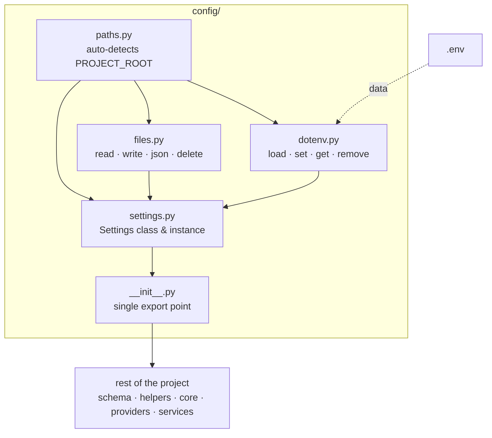

# Python Project Setup
> *"Where eyes fail, structure becomes the light — and a blind man with a strong foundation walks further than a sighted man without one."*

## Philosophy

Every Python project shares identical foundational layers. This skill pre-builds those layers so they are:
1. **Copied whole** — never modified after scaffolding
2. **Framework-agnostic** — works in FastAPI, Flask, CLI, scripts, or AI agents
3. **Zero business logic** — pure infrastructure code

### Available Tools

| Tool | Command | Scaffolds |
|:---|:---|:---|
| `bootstrap` | `human-skills '{"tool_name": "bootstrap", ...}'` | Initializes a complete new project skeleton (Dirs, Config, Helpers) |
| `setconfig` | `human-skills '{"tool_name": "setconfig", ...}'` | `src/config/` — Settings, env, file I/O, logger |
| `sethelpers` | `human-skills '{"tool_name": "sethelpers", ...}'` | `src/helpers/` — Exceptions, utils, middleware, DB |

---

## Bootstrap
> *"One command. Full project skeleton."*

Initializes a complete, production-ready project from scratch — directories, config layer, helpers layer, rules, and a FastAPI-ready `main.py` entry point.

### How to use?
```bash
human-skills '{
    "tool_name": "bootstrap",
    "tool_args": {
        "destination": "/path/to/new_project"
    }
}'
```

### What bootstrap creates

```
project_root/
├── main.py                  ← FastAPI entry point with auto-kill, health check, lifespan
├── .env                     ← Environment variables (empty, fill from .env.example)
├── .env.example             ← Template for required env vars
├── .gitignore               ← Pre-configured for Python projects
├── README.md
├── LICENSE                  ← MIT License
├── docs/
├── logs/
├── tests/
│   └── __init__.py
├── .agents/rules/           ← Coding standards synced from human-skills
│   ├── coding-standards.md
│   ├── architecture-patterns.md
│   ├── maintenance-testing.md
│   ├── config-path-rules.md
│   ├── config-usage-rules.md
│   ├── project-config-example.md
│   └── project-tree-example.md
└── src/
    ├── __init__.py
    ├── requirements.txt
    ├── config/              ← [setconfig] Settings, env, file I/O, logger
    ├── helpers/             ← [sethelpers] Exceptions, retry, middleware, DB
    ├── core/
    ├── providers/
    ├── schema/
    ├── services/
    └── routers/
```

### main.py Skeleton Features

The generated `main.py` includes:

1. **FastAPI app** with lifespan (startup/shutdown hooks)
2. **Logger** initialized via `setup_logger`
3. **CORS, Middleware, Error Handlers** auto-registered from `src/helpers`
4. **Database** hooks (commented out, uncomment when needed)
5. **Health check** endpoint at `/health`
6. **Auto-kill switch** — `kill_pid(port)` frees the port before starting

> [!CAUTION]
> **Never remove `kill_pid(port)` from main.py!**
> This function auto-kills any orphaned server process holding the port before startup. Without it, you'll get `Address already in use` errors and the server won't start. Even if an agent refactors main.py, this call must always be preserved.

---

## SetConfig
> *"One command. Zero boilerplate."*

Scaffolds the canonical `src/config/` layer into any project.

### Config Structure
```
config/
├── __init__.py       ← auto-loads dotenv, exports EVERYTHING
├── paths.py          ← PROJECT_ROOT auto-detection
├── files.py          ← read/write/json/delete utilities
├── dotenv.py         ← load/set/get/remove .env values
├── settings.py       ← Settings class and instance
└── logger.py         ← Unified Rotating Logger setup
```

### Internal Flow



### Core Rules
1. `config/` is **always copied whole** into every project — never modified
2. Project-specific fields go in `src/config/settings.py` — not the template
3. `paths.py` auto-detects `PROJECT_ROOT` via marker files — no hardcoding
4. `dotenv.py` uses `os.environ.setdefault` — never overwrites already-set vars
5. All path fields in `Settings` are resolved relative to `PROJECT_ROOT`

### How to use?

#### 1. Fresh project (safe mode — skips existing files)
```bash
human-skills '{
    "tool_name": "setconfig",
    "tool_args": {
        "destination": "/path/to/your_project/src/config"
    }
}'
```

#### 2. Force overwrite existing files
```bash
human-skills '{
    "tool_name": "setconfig",
    "tool_args": {
        "destination": "/path/to/your_project/src/config",
        "override": "true"
    }
}'
```

> After scaffolding: add project-specific fields to `settings.py` and fill in `.env` from `.env.example`.

---

## SetHelpers
> *"Universal utilities, zero boilerplate."*

Scaffolds battle-tested helper modules that every Python project needs. These are **framework-agnostic** — they work identically in FastAPI, Flask, CLI tools, or background workers.

### Helpers Structure
```
helpers/
├── __init__.py       ← Single export point with graceful degradation
├── exceptions.py     ← AppError → NotFoundError, ValidationError, etc.
├── date_utils.py     ← ISO 8601, timezone-aware parsing, relative time
├── retry.py          ← Tenacity-based exponential backoff (sync + async)
├── port_utils.py     ← Auto-kill orphaned server processes
├── cors.py           ← [Optional] CORS configuration (requires FastAPI)
├── middleware.py     ← [Optional] Request logging middleware (requires FastAPI)
├── error_handlers.py ← [Optional] Global exception handlers (requires FastAPI)
├── connection.py     ← [Optional] Async database engine (requires SQLAlchemy)
└── repository.py     ← [Optional] Base CRUD repository (requires SQLAlchemy)
```

### What each file provides

**`exceptions.py`** — Universal exception hierarchy:
```python
from src.helpers.exceptions import AppError, NotFoundError, ValidationError

raise NotFoundError("User", user_id)        # → 404
raise ValidationError("Invalid email")       # → 400
raise ExternalServiceError("Stripe", "...")   # → 502
raise PermissionDeniedError()                 # → 403
raise ConflictError("Duplicate entry")        # → 409
raise RateLimitError(retry_after=60)          # → 429
```

**`date_utils.py`** — Standardized timestamps:
```python
from src.helpers.date_utils import get_now_iso, relative_time, parse_iso

timestamp = get_now_iso()              # "2025-05-15T14:30:00+00:00"
ago = relative_time(some_datetime)     # "2 hours ago"
dt = parse_iso("2025-05-15T14:30:00") # datetime object (UTC)
```

**`retry.py`** — Production-grade retry logic:
```python
from src.helpers.retry import retry_on_failure, retry_async_on_failure

@retry_on_failure(max_attempts=3)
def call_external_api():
    response = requests.get("https://api.example.com", timeout=10)
    response.raise_for_status()

@retry_async_on_failure(max_attempts=5, retryable=(ConnectionError, TimeoutError))
async def fetch_data():
    async with httpx.AsyncClient() as client:
        resp = await client.get("https://api.example.com", timeout=10)
        resp.raise_for_status()
```

**`port_utils.py`** — Auto-kill orphaned server processes:
```python
from src.helpers.port_utils import kill_pid, get_pid

kill_pid(8000)   # Kills any process holding port 8000
get_pid(8000)    # Returns list of PIDs on port 8000
```

### Graceful Degradation Pattern

`helpers/__init__.py` uses a **graceful degradation** pattern for optional dependencies. This means:

- **Core helpers** (exceptions, date_utils, retry, port_utils) — **always available**, no extra dependencies needed
- **Web helpers** (cors, middleware, error_handlers) — **only available if FastAPI is installed**
- **DB helpers** (connection, repository) — **only available if SQLAlchemy is installed**

```python
# ── Always works (no optional dependencies) ──
from src.helpers import AppError, NotFoundError, retry_on_failure, kill_pid

# ── Only works if FastAPI is installed ──
from src.helpers import register_cors, register_middleware, register_error_handlers

# ── Only works if SQLAlchemy is installed ──
from src.helpers import init_db, get_session, shutdown_db, BaseRepository
```

> [!IMPORTANT]
> **When an optional dependency is not installed**, only those specific components will be unavailable — all other helpers will continue to work normally. This is achieved via `try-except ImportError: pass` blocks in `__init__.py`. These `except: pass` blocks are **intentional** and are not linter violations.

### How to use?

#### 1. Fresh project (safe mode — only adds new files, never touches existing)
```bash
human-skills '{
    "tool_name": "sethelpers",
    "tool_args": {
        "destination": "/path/to/your_project/src/helpers"
    }
}'
```

#### 2. Force overwrite matching files only
```bash
human-skills '{
    "tool_name": "sethelpers",
    "tool_args": {
        "destination": "/path/to/your_project/src/helpers",
        "override": "true"
    }
}'
```

> After scaffolding:
> 1. Rename `AppError` → `YourProjectError` in `exceptions.py` (optional)
> 2. Add `tenacity` to your dependencies: `pip install tenacity`
> 3. Import: `from src.helpers import AppError, NotFoundError`

---

## Checklist When Setting Up a New Project

**For a brand new empty project:**
- [ ] Run `bootstrap` → `human-skills '{"tool_name": "bootstrap", "tool_args": {"destination": "."}}'`
- [ ] Copy `root/.env.example` to `root/.env` and fill in mandatory fields
- [ ] Add project-specific fields to `src/config/settings.py`
- [ ] Rename `AppError` in `exceptions.py` to your project name (optional)
- [ ] Add required dependencies to `pyproject.toml` (e.g. `tenacity`, `fastapi`, `sqlalchemy[asyncio]`, `aiosqlite`)
- [ ] ⚠️ Never remove `kill_pid(port)` from `main.py`

**For an existing project:**
- [ ] Run `setconfig` → scaffolds `src/config/`
- [ ] Run `sethelpers` → scaffolds `src/helpers/` (Exceptions, Utils, Retry, FastAPI Middleware, Async DB Layer)