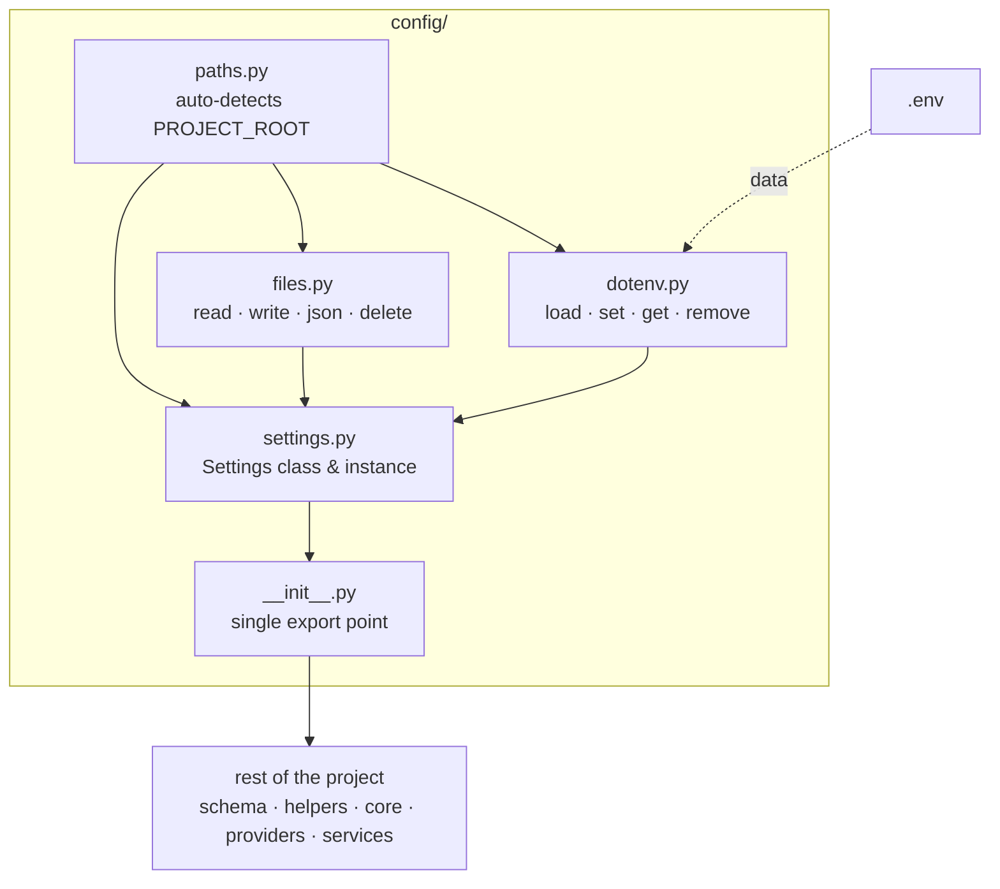

# Python Project Setup
> *"Where eyes fail, structure becomes the light — and a blind man with a strong foundation walks further than a sighted man without one."*

## Philosophy

Every Python project shares identical foundational layers. This skill pre-builds those layers so they are:
1. **Copied whole** — never modified after scaffolding
2. **Framework-agnostic** — works in FastAPI, Flask, CLI, scripts, or AI agents
3. **Zero business logic** — pure infrastructure code

### Available Tools

| Tool | Command | Scaffolds |
|:---|:---|:---|
| `setconfig` | `human-skills '{"tool_name": "setconfig", ...}'` | `src/config/` — Settings, env, file I/O, logger |
| `sethelpers` | `human-skills '{"tool_name": "sethelpers", ...}'` | `src/helpers/` — Exceptions, dates, retry |
| `setapi` | `human-skills '{"tool_name": "setapi", ...}'` | `src/api/` — Error handlers, middleware, CORS (FastAPI) |
| `setdb` | `human-skills '{"tool_name": "setdb", ...}'` | `src/db/` — Async SQLAlchemy connection + CRUD repository |

---

## SetConfig
> *"One command. Zero boilerplate."*

Scaffolds the canonical `src/config/` layer into any project.

### Config Structure
```
config/
├── __init__.py       ← auto-loads dotenv, exports EVERYTHING
├── paths.py          ← PROJECT_ROOT auto-detection
├── files.py          ← read/write/json/delete utilities
├── dotenv.py         ← load/set/get/remove .env values
├── settings.py       ← Settings class and instance
└── logger.py         ← Unified Rotating Logger setup
```

### Internal Flow



### Core Rules
1. `config/` is **always copied whole** into every project — never modified
2. Project-specific fields go in `src/config/settings.py` — not the template
3. `paths.py` auto-detects `PROJECT_ROOT` via marker files — no hardcoding
4. `dotenv.py` uses `os.environ.setdefault` — never overwrites already-set vars
5. All path fields in `Settings` are resolved relative to `PROJECT_ROOT`

### How to use?

#### 1. Fresh project (safe mode — skips existing files)
```bash
human-skills '{
    "tool_name": "setconfig",
    "tool_args": {
        "destination": "/path/to/your_project/src/config"
    }
}'
```

#### 2. Force overwrite existing files
```bash
human-skills '{
    "tool_name": "setconfig",
    "tool_args": {
        "destination": "/path/to/your_project/src/config",
        "override": "true"
    }
}'
```

> After scaffolding: add project-specific fields to `settings.py` and fill in `.env` from `.env.example`.

---

## SetHelpers
> *"Universal utilities, zero boilerplate."*

Scaffolds battle-tested helper modules that every Python project needs. These are **framework-agnostic** — they work identically in FastAPI, Flask, CLI tools, or background workers.

### Helpers Structure
```
helpers/
├── exceptions.py   ← AppError → NotFoundError, ValidationError, ExternalServiceError, PermissionDeniedError, ConflictError, RateLimitError
├── date_utils.py   ← ISO 8601, timezone-aware parsing, human-readable relative time
└── retry.py        ← Tenacity-based exponential backoff with jitter (sync + async)
```

### What each file provides

**`exceptions.py`** — Universal exception hierarchy:
```python
from src.helpers.exceptions import AppError, NotFoundError, ValidationError

raise NotFoundError("User", user_id)        # → 404
raise ValidationError("Invalid email")       # → 400
raise ExternalServiceError("Stripe", "...")   # → 502
raise PermissionDeniedError()                 # → 403
raise ConflictError("Duplicate entry")        # → 409
raise RateLimitError(retry_after=60)          # → 429
```

**`date_utils.py`** — Standardized timestamps:
```python
from src.helpers.date_utils import get_now_iso, relative_time, parse_iso

timestamp = get_now_iso()              # "2025-05-15T14:30:00+00:00"
ago = relative_time(some_datetime)     # "2 hours ago"
dt = parse_iso("2025-05-15T14:30:00") # datetime object (UTC)
```

**`retry.py`** — Production-grade retry logic:
```python
from src.helpers.retry import retry_on_failure, retry_async_on_failure

@retry_on_failure(max_attempts=3)
def call_external_api():
    response = requests.get("https://api.example.com", timeout=10)
    response.raise_for_status()

@retry_async_on_failure(max_attempts=5, retryable=(ConnectionError, TimeoutError))
async def fetch_data():
    async with httpx.AsyncClient() as client:
        resp = await client.get("https://api.example.com", timeout=10)
        resp.raise_for_status()
```

### How to use?

#### 1. Fresh project (safe mode — only adds new files, never touches existing)
```bash
human-skills '{
    "tool_name": "sethelpers",
    "tool_args": {
        "destination": "/path/to/your_project/src/helpers"
    }
}'
```

#### 2. Force overwrite matching files only
```bash
human-skills '{
    "tool_name": "sethelpers",
    "tool_args": {
        "destination": "/path/to/your_project/src/helpers",
        "override": "true"
    }
}'
```

> After scaffolding:
> 1. Rename `AppError` → `YourProjectError` in `exceptions.py` (optional)
> 2. Add `tenacity` to your dependencies: `pip install tenacity`
> 3. Import: `from src.helpers.exceptions import AppError, NotFoundError`

---

## SetApi
> *"Production middleware in one call."*

Scaffolds a battle-tested FastAPI middleware stack. **Framework-specific: FastAPI only.**
Auto-integrates with `sethelpers` exceptions — if `AppError` hierarchy exists, all subclasses map to their correct HTTP status codes automatically.

### API Structure
```
api/
├── error_handlers.py   ← AppError→JSON, ValidationError→422, Exception→500 (catch-all)
├── middleware.py        ← Request-ID, latency logging, OWASP security headers, HSTS
└── cors.py              ← Settings-driven CORS (zero hardcoding)
```

### How to use?

```bash
human-skills '{
    "tool_name": "setapi",
    "tool_args": {
        "destination": "/path/to/your_project/src/api"
    }
}'
```

### Integration in main.py

```python
from fastapi import FastAPI
from src.config import Settings, setup_logger
from src.api.error_handlers import register_error_handlers
from src.api.middleware import register_middleware
from src.api.cors import register_cors

logger = setup_logger(Settings.LOG_DIR / "server.log", name="myproject.main")
app = FastAPI(title=Settings.PROJECT_NAME, version=Settings.VERSION)

# One-time setup — order matters
register_cors(app, Settings)
register_middleware(app, logger, Settings)
register_error_handlers(app, logger)
```

> After scaffolding: every response automatically carries `X-Request-ID`, security headers, and all errors return consistent JSON.

---

## SetDb
> *"Async database in three files."*

Scaffolds an async SQLAlchemy database layer with connection management and a generic CRUD repository.

### DB Structure
```
db/
├── __init__.py       ← exports: init_db, get_session, shutdown_db, BaseRepository
├── connection.py     ← Async engine factory + session dependency
└── repository.py     ← Generic async CRUD (get, list, create, update, delete, count, exists)
```

### How to use?

```bash
human-skills '{
    "tool_name": "setdb",
    "tool_args": {
        "destination": "/path/to/your_project/src/db"
    }
}'
```

### Integration in main.py (FastAPI lifespan)

```python
from contextlib import asynccontextmanager
from src.db import init_db, shutdown_db

@asynccontextmanager
async def lifespan(app):
    init_db(Settings.DATABASE_URL)
    yield
    await shutdown_db()

app = FastAPI(lifespan=lifespan)
```

### Creating a model repository

```python
from sqlalchemy.orm import DeclarativeBase, Mapped, mapped_column
from src.db import BaseRepository

class Base(DeclarativeBase):
    pass

class User(Base):
    __tablename__ = "users"
    id: Mapped[int] = mapped_column(primary_key=True)
    name: Mapped[str]
    email: Mapped[str]

class UserRepository(BaseRepository[User]):
    def __init__(self, session):
        super().__init__(User, session)
```

> After scaffolding:
> 1. Install: `pip install 'sqlalchemy[asyncio]' aiosqlite` (or `asyncpg` for PostgreSQL)
> 2. Add `DATABASE_URL` to `.env` and `Settings`
> 3. Create model-specific repositories extending `BaseRepository`

---

## Checklist When Setting Up a New Project

- [ ] Run `setconfig` → scaffolds `src/config/`
- [ ] Run `sethelpers` → scaffolds `src/helpers/`
- [ ] Run `setapi` → scaffolds `src/api/` (FastAPI projects only)
- [ ] Run `setdb` → scaffolds `src/db/` (database projects only)
- [ ] Copy `root/.env.example` to `root/.env` and fill in mandatory fields
- [ ] Add project-specific fields to `src/config/settings.py`
- [ ] Rename `AppError` in `exceptions.py` to your project name (optional)
- [ ] Add `tenacity`, `sqlalchemy[asyncio]` to `pyproject.toml` dependencies