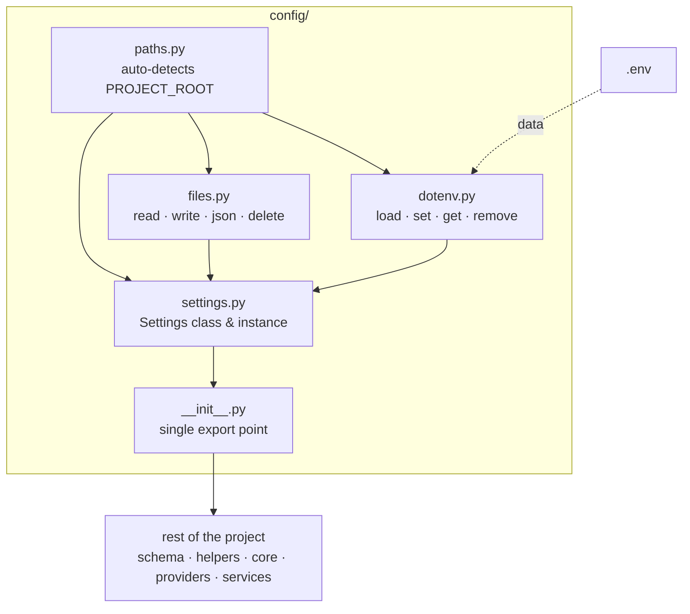

# Scaffold Config
> *"One command. Zero boilerplate."*

Scaffolds the canonical `src/config/` layer into any Python project. This layer is the **Single Source of Truth** for all configuration — settings, environment variables, file operations, and logging.

## How to Use

### Fresh project (safe mode — skips existing files)
```bash
human-skills '{
    "tool_name": "setconfig",
    "tool_args": {
        "destination": "/path/to/your_project/src/config"
    }
}'
```

### Force overwrite existing files
```bash
human-skills '{
    "tool_name": "setconfig",
    "tool_args": {
        "destination": "/path/to/your_project/src/config",
        "override": "true"
    }
}'
```

---

## Config Structure

```
config/
├── __init__.py       ← Auto-loads dotenv, exports EVERYTHING
├── paths.py          ← PROJECT_ROOT auto-detection
├── files.py          ← read/write/json/delete utilities
├── dotenv.py         ← load/set/get/remove .env values
├── settings.py       ← Settings class and instance
└── logger.py         ← Unified Rotating Logger setup
```

## Internal Flow



## Core Rules

1. `config/` is **always copied whole** into every project — never modified
2. Project-specific fields go in `src/config/settings.py` — not the template
3. `paths.py` auto-detects `PROJECT_ROOT` via marker files — no hardcoding
4. `dotenv.py` uses `os.environ.setdefault` — never overwrites already-set vars
5. All path fields in `Settings` are resolved relative to `PROJECT_ROOT`

---

## API Quick Reference

| Need | Function | Import |
|:---|:---|:---|
| Check existence | `exists(rel)` | `from src.config import exists` |
| Read file as str | `read_text(rel)` | `from src.config import read_text` |
| Read file as dict | `read_json(rel)` | `from src.config import read_json` |
| Write str to file | `write_text(rel, content)` | `from src.config import write_text` |
| Write dict to file | `write_json(rel, data)` | `from src.config import write_json` |
| Create directories | `ensure_dir(rel)` | `from src.config import ensure_dir` |
| Delete file or dir | `delete(rel)` | `from src.config import delete` |
| List / glob files | `list_files(rel, pattern)` | `from src.config import list_files` |
| Absolute path str | `get_abs_path(rel)` | `from src.config import get_abs_path` |
| Setup logger | `setup_logger(path, name)` | `from src.config import setup_logger` |
| Access settings | `Settings.FIELD` | `from src.config import Settings` |

> After scaffolding: add project-specific fields to `settings.py` and fill `.env` from `.env.example`.

---

## Enforcement

See `.agents/rules/config-path-rules.md` and `.agents/rules/config-usage-rules.md` for strict usage patterns. `from pathlib import Path` is **FORBIDDEN** outside `config/`.
