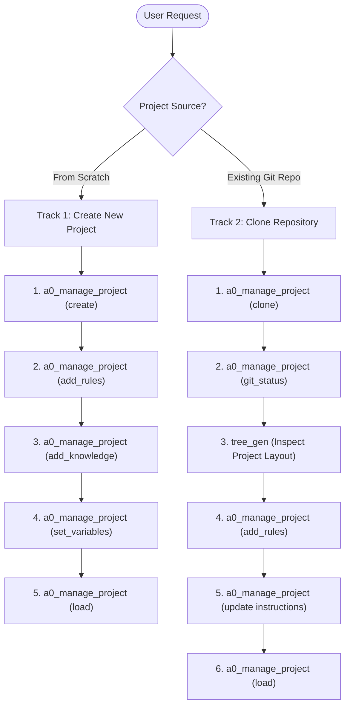

# Agent Zero Project Manager (`a0-manage-project`)

## Overview

This skill provides complete, production-ready workflows for setting up and managing Agent Zero projects.

Key capabilities:
1. **Lifecycle Management**: Create from scratch, list, load, update, and delete projects.
2. **Git Integration**: Clone remote repositories directly with HTTP token authentication and inspect git repository status.
3. **Structure Inspection**: Use `tree_gen` to analyze project layout before writing tailored system instructions.
4. **Instructions & Rules System**: Main system prompt + modular rule templates in `.a0proj/instructions/`.
5. **Knowledge Base**: Project-specific reference documents indexed in `.a0proj/knowledge/main/`.
6. **Environment Configuration**: Set non-sensitive environment variables in `.a0proj/variables.env`.

---

## The `a0_manage_project` Tool

The `a0_manage_project` tool is the central dispatcher for all project management tasks.

### Supported Actions:
- **`create`**: Initialize a new empty project.
- **`clone`**: Clone a Git repository as an Agent Zero project.
- **`load`**: Load complete project metadata, instruction count, and git status.
- **`update`**: Update `title`, `description`, `instructions`, `color`, or `memory`.
- **`add_rules`**: Copy pre-defined rule templates into `.a0proj/instructions/`.
- **`add_knowledge`**: Add reference markdown/text files into `.a0proj/knowledge/main/`.
- **`set_variables`**: Set environment variables in `.a0proj/variables.env`.
- **`git_status`**: Check git branch, dirty status, untracked files, and latest commit.
- **`list`**: List all active projects.
- **`delete`**: Safely remove a project directory.

---

## Available Rule Templates Catalog

Use `add_rules` with a comma-separated list of any of the following 13 pre-defined templates:

| Category | Template Filename | Purpose / Scope |
|:---|:---|:---|
| **Common** | `common-coding-style.md` | Universal clean code, naming conventions, DRY/SOLID standards |
| | `common-git-workflow.md` | Feature branching, commit conventions, safe push/pull |
| | `common-patterns.md` | Layered architecture, single responsibility, dependency inversion |
| | `common-security.md` | Input validation, sanitization, secret management safety |
| | `common-testing.md` | Test structure, unit/integration testing standards |
| **Context** | `context-dev.md` | Active development and rapid implementation guidelines |
| | `context-research.md` | Exploration, deep-dive analysis, and fact-checking protocols |
| | `context-review.md` | Code review and pull request audit checklist |
| **Python** | `python-coding-style.md` | PEP 8, Type Hints, Pydantic data modeling standards |
| | `python-hooks.md` | Pre-commit hooks, linter integration |
| | `python-patterns.md` | Clean Pythonic idioms, async I/O, context managers |
| | `python-security.md` | Subprocess safety, path traversal prevention, safe eval |
| | `python-testing.md` | `pytest` fixtures, mock strategies, parameterization |

---

## Decision Tree



---

## Complete Workflow Examples

### 🚀 Track 1: Create Project from Scratch (Continuous Chain)

#### Step 1: Create the Project
```json
{
  "tool_name": "a0_manage_project",
  "tool_args": {
    "action": "create",
    "project_name": "my-bot",
    "title": "Smart Assistant Bot",
    "description": "General purpose automation assistant",
    "color": "#10B981",
    "memory": "own"
  }
}
```

#### Step 2: Inject Relevant Rule Templates
```json
{
  "tool_name": "a0_manage_project",
  "tool_args": {
    "action": "add_rules",
    "project_name": "my-bot",
    "rules": "python-coding-style.md, common-git-workflow.md, common-security.md"
  }
}
```

#### Step 3: Add Knowledge / Domain Reference
```json
{
  "tool_name": "a0_manage_project",
  "tool_args": {
    "action": "add_knowledge",
    "project_name": "my-bot",
    "filename": "bot-guidelines.md",
    "content": "# Bot Operational Guidelines\n\n1. Always respond in concise markdown.\n2. Verify tool parameters before execution."
  }
}
```

#### Step 4: Set Environment Variables
```json
{
  "tool_name": "a0_manage_project",
  "tool_args": {
    "action": "set_variables",
    "project_name": "my-bot",
    "variables": "ENVIRONMENT=development\nLOG_LEVEL=DEBUG\nTIMEOUT=30"
  }
}
```

#### Step 5: Verify Full Project State
```json
{
  "tool_name": "a0_manage_project",
  "tool_args": {
    "action": "load",
    "project_name": "my-bot"
  }
}
```

---

### 📦 Track 2: Clone Existing Git Repository (Continuous Chain)

#### Step 1: Clone Repository
```json
{
  "tool_name": "a0_manage_project",
  "tool_args": {
    "action": "clone",
    "project_name": "finance-api",
    "git_url": "https://github.com/mdnaimul22/GitManager.git",
    "title": "Finance API Engine",
    "description": "High-throughput financial transactions service"
  }
}
```

#### Step 2: Check Git Status
```json
{
  "tool_name": "a0_manage_project",
  "tool_args": {
    "action": "git_status",
    "project_name": "finance-api"
  }
}
```

#### Step 3: Generate & Inspect Directory Layout (`tree_gen`)
> Use `tree_gen` to understand the codebase structure before writing instructions.

**For Local Machine:**
```json
{
  "tool_name": "tree_gen",
  "tool_args": {
    "input_path": "/home/{user_name}/a0/usr/workdir/example-project-name",
    "file_name": "structure",
    "ignored_path": "node_modules, dist, build, .git, __pycache__, .venv"
  }
}
```

**For Docker Container:**
```json
{
  "tool_name": "tree_gen",
  "tool_args": {
    "input_path": "/a0/usr/workdir/example-project-name",
    "file_name": "structure",
    "ignored_path": "node_modules, dist, build, .git, __pycache__, .venv"
  }
}
```

#### Step 4: Inject Coding & Architecture Rules
```json
{
  "tool_name": "a0_manage_project",
  "tool_args": {
    "action": "add_rules",
    "project_name": "finance-api",
    "rules": "python-patterns.md, python-security.md, common-git-workflow.md"
  }
}
```

#### Step 5: Update Instructions & System Prompt
```json
{
  "tool_name": "a0_manage_project",
  "tool_args": {
    "action": "update",
    "project_name": "finance-api",
    "title": "Finance API Engine v2",
    "instructions": "## Role\nYou are a Senior Financial Systems Architect.\n\n## Standards\n- Strictly adhere to Python patterns and security guidelines in .a0proj/instructions/.\n- Validate all financial inputs before database persistence.",
    "color": "#6366F1"
  }
}
```

#### Step 6: Verify Cloned Project State
```json
{
  "tool_name": "a0_manage_project",
  "tool_args": {
    "action": "load",
    "project_name": "finance-api"
  }
}
```

---

### 📋 General Project Management Commands

#### List All Active Projects
```json
{
  "tool_name": "a0_manage_project",
  "tool_args": {
    "action": "list"
  }
}
```

#### Delete a Project
```json
{
  "tool_name": "a0_manage_project",
  "tool_args": {
    "action": "delete",
    "project_name": "my-bot"
  }
}
```

---

## Best Practices

### ✅ DO:
1. **Use `clone` for existing git repositories**; `.a0proj` metadata will be automatically initialized and merged.
2. **Use `tree_gen` after cloning** to inspect the repository hierarchy before crafting prompt instructions.
3. **Use `add_rules`** with standard template names rather than writing repetitive manual instructions.
4. **Use lowercase alphanumeric names with hyphens** for `project_name` (e.g. `finance-api`, `crm-bot`).

### ❌ DON'T:
1. **Don't put sensitive credentials (passwords, private API keys) in `set_variables`** — place secrets in `.a0proj/secrets.env`.
2. **Don't use spaces or uppercase characters** in `project_name`.
