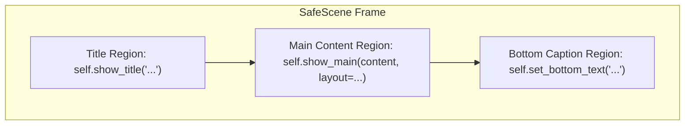

# Mathematical & Scientific Animation (Manim)

## When to Use

Activate this skill when the user asks to:
- Create mathematical animations, geometry transformations, or formula morphs.
- Build clean educational math lessons using `SafeScene` and prebuilt `templates`.
- Visualize calculus, coordinate systems, linear algebra, or physics phenomena.
- Generate educational math videos (MP4), WebM overlays, or animated GIF demonstrations.
- Render transparent animations for video compositing or slide presentations.
- Export single-frame mathematical figures or diagrams to PNG.

---

## The **math_animate** Tool

This skill uses the `math_animate` tool to compile and render Python Manim scenes into high-quality media files.

### 📝 PARAMETERS:

| Parameter | Type | Required | Default | Description |
|:---|:---|:---:|:---|:---|
| `example` | `string` | No | — | Curated quality examples inspector. Pass `"list"` to view all curated `scene_name`s in `command.json`, or pass `"<scene_name>"` to view its full code and parameters. |
| `scene_code` | `string` | **Yes\*** | — | Python code defining a Manim Scene (`Scene`, `ThreeDScene`, or `SafeScene`). \*Not required if `example` is provided. |
| `scene_name` | `string` | No | *auto-detected* | Name of the Scene class to render (e.g. `"EquationLesson"`). |
| `output_path` | `string` | No | `data/math_animate/<Scene>_<timestamp>.<fmt>` | Target filepath for output. Always placed in `data/` directory. |
| `aspect_ratio` | `string` | No | `"16:9"` | Aspect ratio: `"16:9"` (landscape) or `"9:16"` (vertical mobile / Shorts / Reels). |
| `quality` | `string` | No | `"medium"` | Preset: `"preview"` (draft), `"low"` (480p), `"medium"` (720p), `"high"` (1080p), `"4k"` (2160p). |
| `format` | `string` | No | `"mp4"` | Output format: `"mp4"`, `"gif"`, `"png"`, `"webm"`. (Default: `"gif"` if `quality="preview"` without explicit format). |
| `transparent` | `string` | No | `"false"` | Render with an alpha/transparent background (`"true"` / `"false"`). |
| `background_color` | `string` | No | *default black* | Hex color code for canvas background (e.g. `"#1a1a2e"`). |
| `allow_unsafe_code`| `string` | No | `"false"` | Bypass AST security denylist check (`"true"` / `"false"`). |

### 🎬 QUALITY & ASPECT RATIO PRESETS:

| Quality Preset | 16:9 Resolution | 9:16 Resolution | Frame Rate | Intended Use |
|:---|:---|:---|:---|:---|
| `"preview"` | 854x480 | 480x854 | 15 fps | Quick draft test (MP4 or GIF) |
| `"low"` | 854x480 | 480x854 | 15 fps | Fast development draft |
| `"medium"` | 1280x720 | 720x1280 | 30 fps | Standard balance of speed and clarity (Default) |
| `"high"` | 1920x1080 | 1080x1920 | 60 fps | Full HD crisp video |
| `"4k"` | 3840x2160 | 2160x3840 | 60 fps | Ultra-high definition presentation / master output |

---

## 📋 HOW TO CALL THIS TOOL:

The agent executes `human-skills` with the JSON payload passed directly as a string argument:

```bash
human-skills '{"tool_name": "math_animate", "tool_args": {"scene_code": "class CircleToSquare(Scene):\n    def construct(self):\n        circle = Circle(color=BLUE)\n        square = Square(color=RED)\n        self.play(Create(circle))\n        self.play(Transform(circle, square))\n        self.wait(1)", "scene_name": "CircleToSquare", "quality": "medium", "aspect_ratio": "16:9", "format": "mp4", "output_path": "data/circle_to_square.mp4"}}'
```

### ⚠️ RUNTIME INJECTIONS & SYSTEM GUARANTEES:
- **Automatic Imports**: Both `from manim import *` and `from templates import *` are automatically injected into `scene_code`.
- **Prebuilt Visual Kit**: `SafeScene`, `Layout`, and all 14 specialized templates are immediately available without manual imports.
- **Scene Detection**: If `scene_name` is omitted, the tool automatically detects the single defined `Scene` class.
- **AST Security**: Unsafe imports (`os`, `sys`, `subprocess`, `socket`, `open`, etc.) are blocked by default.

---

## 🎨 Visual Kit & SafeScene Architecture

For educational math animations, inherit from `SafeScene` rather than standard `Scene`. `SafeScene` automatically manages screen boundaries, responsive scaling, and eliminates overlap bugs.



### Core API Methods:

| Method | Purpose |
|:---|:---|
| `self.show_title(text, color=WHITE)` | Writes title at top; replaces previous title cleanly if called again. |
| `self.show_main(content, layout=Layout.CENTER, caption=None)` | Clears previous main content and fades in new content. |
| `self.transform_main(content, layout=Layout.CENTER, caption=None)` | Smoothly morphs current main content into new content. |
| `self.set_bottom_text(text_or_none, color=WHITE)` | Displays explanatory subtitle at bottom. Pass `None` to fade out. |
| `self.play_action(animation)` | Executes template-owned animation (e.g. `self.play_action(template.action(...))`). |
| `self.clear_content()` | Fades out both main content and bottom text. |
| `self.fade_out_all()` | Fades out entire screen (title, main, bottom) at lesson end. |

### Layout Control:
- `layout=Layout.CENTER`: Automatically scales and centers a single template.
- `layout=Layout.SPLIT`: Displays two templates side-by-side: `VGroup(left_template, right_template)`.
- *For detailed frame mathematics and composition rules, see [visual-kit-api.md](references/visual-kit-api.md) and [layout-composition.md](references/layout-composition.md).*

---

## 📦 Complete API Catalog of Prebuilt Math Templates

All 14 templates inherit `VisualTemplate`, enforce explicit `state` values, and are exposed globally via `from templates import *`.

---

### 1. `EquationTemplate`
Mathematical formulas, derivations, multi-step history, and expression morphing.
- **Valid States**:
  - `"display"`: Single formula. Requires `expression="str"`. (Does NOT accept `expressions`).
  - `"derivation"`: 1-3 step derivation history. Requires `expressions=["step1", "step2", ...]`.
  - `"statements"`: Up to 3 equivalent statements. Requires `expressions=["stmt1", "stmt2"]`.
- **Constructor Parameters**:
  - `state: str` (REQUIRED)
  - `expression: str | None = None`
  - `expressions: list[str] | None = None`
- **Action Methods**:
  - `set_expression(expression: str) -> Animation`: Morphs current equation into a new expression (`display` state).
  - `advance_step(expression: str) -> Animation`: Advances derivation history with next step (`derivation` state).
  - `highlight_formula(index: int | None = None) -> Animation`: Pulses yellow highlight around formula.
- **Example**:
  ```python
  eq = EquationTemplate(state="display", expression="E = mc^2")
  # Or derivation:
  eq = EquationTemplate(state="derivation", expressions=["2x + 4 = 10", "2x = 6", "x = 3"])
  self.play_action(eq.advance_step("x = 3"))
  ```

---

### 2. `FunctionGraphTemplate`
Function curves, tangents, secants, definite integrals, marked points, and comparative graphs.
- **Valid States**: `"curve"`, `"marked_points"`, `"secant"`, `"tangent"`, `"area"`, `"signed_areas"`, `"comparison"`.
- **Constructor Parameters**:
  - `state: str` (REQUIRED)
  - `function_type: str = "quadratic"` (`"quadratic"`, `"cubic"`, `"sine"`, `"cosine"`, `"exponential"`, `"linear"`, `"rational"`)
  - `function_parameters: dict | None = None` (e.g. `{"a": 1, "b": 0, "c": 0}`)
  - `function_label: str = "f(x)"`
  - `tangent_x: float = 1.0` (active tangent point for `"tangent"` state)
  - `secant_xs: tuple[float, float] = (-1, 2)` (secant line points for `"secant"` state)
  - `area_interval: tuple[float, float] = (0.5, 2)` (integral shading interval for `"area"` state)
  - `marked_xs: list[float] = ()` (critical x-coordinates for `"marked_points"` state)
  - `comparison_function_type: str | None = None` (second function for `"comparison"` state)
  - `comparison_label: str = "g(x)"`
  - `x_range: tuple[float, float, float] = (-5, 6, 1)`
  - `y_range: tuple[float, float, float] = (-4, 7, 1)`
  - `graph_x_range: tuple[float, float] = (-4.5, 4.5)`
- **Action Methods**:
  - `reveal_tangent() -> Animation`: Draws tangent line at `tangent_x`.
  - `move_secant_point(target_x: float) -> Animation`: Moves secant point towards limit.
  - `shade_interval(start: float, end: float) -> Animation`: Dynamically shades area under curve.
  - `highlight_intercept() -> Animation`: Highlights axis intercept markers.
- **Example**:
  ```python
  graph = FunctionGraphTemplate(state="tangent", function_type="quadratic", tangent_x=1.0)
  self.play_action(graph.reveal_tangent())
  ```

---

### 3. `VectorTemplate`
2D Vectors, coordinate components, vector addition (triangle law), subtraction, projection, and scalar multiplication.
- **Valid States**: `"single"`, `"components"`, `"addition"`, `"subtraction"`, `"scalar_multiple"`, `"projection"`.
- **Constructor Parameters**:
  - `state: str` (REQUIRED)
  - `vector_a: tuple[float, float]` (REQUIRED, e.g. `(3, 2)`)
  - `vector_b: tuple[float, float] | None = None` (second vector for addition/subtraction/projection)
  - `scalar: float = 2.0` (multiplier for `"scalar_multiple"` state)
  - `vector_a_label: str = "a"`, `vector_b_label: str = "b"`, `result_label: str = "r"`
  - `show_grid: bool = True`, `show_coordinate_labels: bool = True`
  - `x_range: tuple[float, float, float] = (-5, 6, 1)`, `y_range: tuple[float, float, float] = (-5, 6, 1)`
- **Action Methods**:
  - `reveal_components() -> Animation`: Draws dashed orthogonal $x$ and $y$ component vectors.
  - `reveal_resultant() -> Animation`: Animates resultant vector $\vec{a} + \vec{b}$.
  - `set_scalar(target_scalar: float) -> Animation`: Scales vector dynamically.
  - `highlight_vector(role: str) -> Animation`: Pulses vector arrow (`role="a"`, `"b"`, or `"r"`).
  - `highlight_projection() -> Animation`: Projects vector $\vec{a}$ onto $\vec{b}$.
- **Example**:
  ```python
  vec = VectorTemplate(state="components", vector_a=(3, 2))
  self.play_action(vec.reveal_components())
  ```

---

### 4. `MatrixTemplate`
Matrix representations, cell highlights, row/column operations, and matrix-matrix multiplication steps.
- **Valid States**: `"display"`, `"product_setup"`, `"product_progress"`, `"product_complete"`.
- **Constructor Parameters**:
  - `state: str` (REQUIRED)
  - `matrix: list[list[float]] | None = None` (data matrix for `"display"` state, e.g. `[[1, 2], [3, 4]]`)
  - `left_matrix: list[list[float]] | None = None` (multiplier matrix $A$ for `"product_*"` states)
  - `right_matrix: list[list[float]] | None = None` (multiplicand matrix $B$ for `"product_*"` states)
  - `left_label: str = "A"`, `right_label: str = "B"`, `result_label: str = "C"`
  - `active_row: int = 0`, `active_column: int = 0`
- **Action Methods**:
  - `reveal_product_cell() -> Animation`: Computes dot product for `active_row` and `active_column`.
  - `select_product_cell(row: int, column: int) -> Animation`: Moves active focus to specified cell.
  - `highlight_row(row: int) -> Animation`: Outlines target row in yellow.
  - `highlight_column(column: int) -> Animation`: Outlines target column in yellow.
  - `highlight_cell(row: int, column: int) -> Animation`: Pulses target entry.
- **Example**:
  ```python
  mat = MatrixTemplate(state="product_setup", left_matrix=[[1, 2], [3, 4]], right_matrix=[[2, 0], [1, 2]])
  self.play_action(mat.reveal_product_cell())
  ```

---

### 5. `NumberLineTemplate`
Configurable real number line with point markers, single/multiple intervals, arithmetic movements, and distance.
- **Valid States**: `"points"`, `"interval"`, `"intervals"`, `"operation"`, `"distance"`.
- **Constructor Parameters**:
  - `state: str` (REQUIRED)
  - `x_range: tuple[float, float, float] = (-5, 6, 1)`
  - `points: list[float] = ()` (labeled points for `"points"` state)
  - `point_labels: list[str] | None = None`
  - `start: float = -2`, `end: float = 2` (interval range for `"interval"` state)
  - `left_closed: bool = True`, `right_closed: bool = True` (bracket/parenthesis styling)
  - `intervals: list[tuple[float, float, bool, bool]] = ()` (for `"intervals"` state)
  - `center: float | None = None`, `radius: float | None = None` (for absolute value `"distance"`)
  - `value: float = 0`, `value_label: str | None = None` (for `"operation"`)
- **Action Methods**:
  - `move_point(target_value: float) -> Animation`: Slides marker along number line.
  - `set_interval(start: float, end: float, left_closed: bool, right_closed: bool) -> Animation`: Updates interval bounds.
  - `highlight_distance() -> Animation`: Highlights segment between center and radius.
- **Example**:
  ```python
  numline = NumberLineTemplate(state="interval", start=-1, end=3, left_closed=True, right_closed=False)
  self.play_action(numline.move_point(2.0))
  ```

---

### 6. `UnitCircleTemplate`
Trigonometric unit circle, arbitrary angle arcs, coordinate readouts $(x, y) = (\cos\theta, \sin\theta)$, and reference triangles.
- **Valid States**: `"base"`, `"angle"`, `"coordinates"`, `"reference_triangle"`.
- **Constructor Parameters**:
  - `state: str` (REQUIRED)
  - `angle_degrees: float = 30` (angle $\theta$ in degrees)
  - `angle_label: str | None = None`
  - `coordinate_label: str | None = None`
  - `cosine_label: str = r"\cos\theta"`, `sine_label: str = r"\sin\theta"`, `radius_label: str = "1"`
  - `show_axes_labels: bool = True`
- **Action Methods**:
  - `rotate_to_angle(target_degrees: float, angle_label=None, coordinate_label=None) -> Animation`: Rotates radius ray to new angle.
  - `reveal_coordinates() -> Animation`: Displays $(\cos\theta, \sin\theta)$ coordinates.
  - `reveal_reference_triangle() -> Animation`: Draws right reference triangle inside circle.
  - `highlight_projection(axis: str) -> Animation`: Pulses projection onto `"x"` or `"y"` axis.
- **Example**:
  ```python
  circle = UnitCircleTemplate(state="coordinates", angle_degrees=45)
  self.play_action(circle.rotate_to_angle(60))
  ```

---

### 7. `LinearTransformationTemplate`
Visualizes 2D linear matrix transformations $T(\vec{x}) = A\vec{x}$ warping coordinate grid lines and basis vectors $\hat{i}, \hat{j}$.
- **Valid States**: `"setup"`, `"comparison"`.
- **Constructor Parameters**:
  - `state: str` (REQUIRED)
  - `matrix: list[list[float]]` (REQUIRED, $2\times 2$ matrix, e.g. `[[2, 1], [0, 1.5]]`)
  - `vectors: list[tuple[float, float]]` (REQUIRED, vectors transformed by matrix, e.g. `[(1, 0), (0, 1)]`)
  - `vector_labels: list[str] | None = None`
  - `active_index: int = 0`
  - `show_span: bool = False`, `show_matrix_label: bool = True`
  - `x_range: tuple[float, float, float] = (-5, 6, 1)`, `y_range: tuple[float, float, float] = (-5, 6, 1)`
- **Action Methods**:
  - `apply_transformation() -> Animation`: Transforms grid and basis vectors using matrix $A$.
  - `highlight_vector(index: int) -> Animation`: Pulses target vector.
  - `highlight_span(index: int) -> Animation`: Visualizes span subspace.
- **Example**:
  ```python
  lin_trans = LinearTransformationTemplate(state="setup", matrix=[[1, 1], [0, 1]], vectors=[(1, 0), (0, 1)])
  self.play_action(lin_trans.apply_transformation())
  ```

---

### 8. `TriangleTemplate`
Right triangles, scalene/isosceles/equilateral triangles, hypotenuse emphasis, altitudes, and angle bisectors.
- **Valid States**: `"right_base"`, `"right_labeled"`, `"right_hypotenuse_highlighted"`, `"right_squares"`, `"general_base"`, `"general_labeled"`, `"altitude"`, `"median"`, `"angle_bisector"`, `"non_right_labeled"`.
- **Constructor Parameters**:
  - `state: str` (REQUIRED)
  - `triangle_type: str = "scalene"` (`"right"`, `"scalene"`, `"equilateral"`, `"isosceles"`)
  - `leg_a: float | None = None`, `leg_b: float | None = None` (for right triangles)
  - `width: float = 3.2`, `height: float = 2.2`, `apex_offset: float = 0.15`
  - `vertex_labels: tuple[str, str, str] = ('A', 'B', 'C')`
  - `side_labels: tuple[str, str, str] = ('a', 'b', 'c')`
  - `active_vertex: str = 'A'`
- **Action Methods**:
  - `highlight_side(side: str) -> Animation`: Outlines side (`side="a"`, `"b"`, or `"c"`).
  - `highlight_angle(vertex: str) -> Animation`: Highlights angle arc at vertex (`vertex="A"`, `"B"`, or `"C"`).
  - `highlight_construction() -> Animation`: Emphasizes altitude, median, or bisector.
- **Example**:
  ```python
  tri = TriangleTemplate(state="right_labeled", leg_a=2.0, leg_b=3.0)
  self.play_action(tri.highlight_side("c"))
  ```

---

### 9. `PythagoreanAreaTemplate`
Geometric proof of $a^2 + b^2 = c^2$ with squares attached to right triangle sides.
- **Valid States**: `"c_square"`, `"ab_squares"`.
- **Constructor Parameters**:
  - `state: str` (REQUIRED)
  - `leg_a: float = 1.35`
  - `leg_b: float = 2.15`
  - `include_side_labels: bool = True`
- **Example**:
  ```python
  pyth = PythagoreanAreaTemplate(state="ab_squares", leg_a=1.5, leg_b=2.0)
  ```

---

### 10. `LineGeometryTemplate`
2D Coordinate geometry, slopes, rise-over-run triangles, midpoints, segment distances, and line intersections.
- **Valid States**: `"point_plot"`, `"slope_rise_run"`, `"midpoint"`, `"distance"`, `"line_equation"`, `"intercepts"`, `"intersection"`.
- **Constructor Parameters**:
  - `state: str` (REQUIRED)
  - `point_a: tuple[float, float]` (REQUIRED, e.g. `(0, 0)`)
  - `point_b: tuple[float, float] | None = None` (second point, e.g. `(3, 2)`)
  - `slope: float | None = None`, `y_intercept: float | None = None`
  - `line2_slope: float | None = None`, `line2_y_intercept: float | None = None` (for `"intersection"`)
  - `x_range: tuple = (-6, 6, 1)`, `y_range: tuple = (-4, 4, 1)`
  - `labels: bool = True`
- **Action Methods**:
  - `show_slope_triangle() -> Animation`: Draws rise-over-run right triangle.
  - `show_midpoint() -> Animation`: Displays midpoint dot and coordinate label.
  - `show_distance() -> Animation`: Highlights segment distance with length label.
  - `show_intercepts() -> Animation`: Points to $x$- and $y$-intercepts.
  - `show_intersection() -> Animation`: Identifies solution point where two lines cross.
- **Example**:
  ```python
  line = LineGeometryTemplate(state="slope_rise_run", point_a=(1, 1), point_b=(4, 3))
  self.play_action(line.show_slope_triangle())
  ```

---

### 11. `CircleTheoremsTemplate`
Circle geometry theorems: tangent-radius perpendicularity, chord bisectors, secants, central angles, and inscribed angles.
- **Valid States**: `"radius_tangent"`, `"chord"`, `"secant"`, `"arc_central"`, `"inscribed_angle"`.
- **Constructor Parameters**:
  - `state: str` (REQUIRED)
  - `radius: float = 2.0`, `center: tuple[float, float] = (0, 0)`
  - `chord_angle: float = 60`
  - `secant_point: tuple[float, float] = (4, 0)`
  - `arc_start_angle: float = 30`, `arc_end_angle: float = 150`
  - `inscribed_vertex_angle: float = 200`
  - `labels: bool = True`
- **Action Methods**:
  - `show_radius_tangent() -> Animation`: Marks $90^\circ$ right angle between radius and tangent line.
  - `show_perpendicular_bisector() -> Animation`: Draws chord bisector through center.
  - `show_arc_angle() -> Animation`: Highlights central angle and subtended arc.
  - `show_inscribed_relationship() -> Animation`: Demonstrates inscribed angle is half of central angle.
- **Example**:
  ```python
  circle_thm = CircleTheoremsTemplate(state="radius_tangent")
  self.play_action(circle_thm.show_radius_tangent())
  ```

---

### 12. `PolygonTransformationTemplate`
2D Rigid transformations of arbitrary polygons: translations, reflections over axes, rotations about a center, and dilations.
- **Valid States**: `"original"`, `"translated"`, `"reflected"`, `"rotated"`, `"dilated"`.
- **Constructor Parameters**:
  - `state: str` (REQUIRED)
  - `vertices: list[tuple[float, float]]` (REQUIRED, e.g. `[(0, 0), (2, 0), (1, 2)]`)
  - `translation_vector: tuple[float, float] = (2, 1)` (for `"translated"` state)
  - `reflection_axis: str = "x"` (`"x"` or `"y"` for `"reflected"` state)
  - `rotation_angle: float = 90`, `rotation_center: tuple[float, float] = (0, 0)` (for `"rotated"` state)
  - `dilation_factor: float = 2.0`, `dilation_center: tuple[float, float] = (0, 0)` (for `"dilated"` state)
  - `x_range: tuple = (-6, 6, 1)`, `y_range: tuple = (-4, 4, 1)`
  - `labels: bool = True`
- **Action Methods**:
  - `translate() -> Animation`: Moves polygon along `translation_vector`.
  - `reflect() -> Animation`: Flips polygon across `reflection_axis`.
  - `dilate() -> Animation`: Scales polygon by `dilation_factor`.
- **Example**:
  ```python
  poly = PolygonTransformationTemplate(state="translated", vertices=[(0, 0), (2, 0), (1, 2)], translation_vector=(2, 1))
  self.play_action(poly.translate())
  ```

---

### 13. `FunctionTranslationTemplate`
Visualizes function shifts $f(x - h) + k$ and horizontal scaling $f(ax)$ against parent curves.
- **Valid States**: `"parent"`, `"comparison"`.
- **Constructor Parameters**:
  - `state: str` (REQUIRED)
  - `parent_function = lambda x: x**2`
  - `h: float = 0` (horizontal shift)
  - `k: float = 0` (vertical shift)
  - `a: float | None = None` (horizontal compression/expansion factor)
  - `anchor_point: tuple[float, float] | None = (0, 0)`
  - `parent_label: str = "f(x)"`, `transformed_label: str | None = None`
  - `x_range: tuple[float, float, float] = (-4, 5, 1)`, `y_range: tuple[float, float, float] = (-3, 7, 1)`
- **Action Methods**:
  - `shift_horizontal(target_h: float) -> Animation`: Animates horizontal translation.
  - `shift_vertical(target_k: float) -> Animation`: Animates vertical translation.
  - `scale_horizontal(target_a: float) -> Animation`: Scales curve horizontally.
- **Example**:
  ```python
  f_trans = FunctionTranslationTemplate(state="comparison", h=2, k=1)
  self.play_action(f_trans.shift_horizontal(2))
  ```

---

### 14. `FractionModelTemplate`
Proportional fraction visual models: horizontal fraction bars, circular pie models, and partition grids.
- **Valid States**: `"bar"`, `"grid"`, `"circle"`.
- **Constructor Parameters**:
  - `state: str` (REQUIRED)
  - `numerator: int = 1`
  - `denominator: int = 2`
  - `show_label: bool = True`
  - `label: str | None = None`
  - `grid_shape: tuple[int, int] | None = None` (e.g. `(2, 5)` for $2\times 5$ grid of 10)
  - `show_part_numbers: bool = False`
- **Action Methods**:
  - `set_fraction(numerator: int, denominator: int) -> Animation`: Updates filled portions.
  - `highlight_filled_parts() -> Animation`: Pulses active numerator fractions.
  - `highlight_wholes() -> Animation`: Highlights complete unit wholes.
  - `show_equivalent_fraction(multiplier: int) -> Animation`: Subdivides parts to show equivalence (e.g. $1/2 = 2/4$).
- **Example**:
  ```python
  frac = FractionModelTemplate(state="circle", numerator=3, denominator=4)
  self.play_action(frac.show_equivalent_fraction(multiplier=2))
  ```

---

## Scenario-Based Instructions

### 📐 Scenario 1: Step-by-Step Derivation with SafeScene & EquationTemplate

**When:** Explaining algebraic proofs, step-by-step problem solving, or formula derivations.

```bash
human-skills '{
    "tool_name": "math_animate",
    "tool_args": {
        "scene_code": "class QuadraticDerivation(SafeScene):\n    def construct(self):\n        self.show_title(\"Solving Quadratic Equation\")\n        eq = EquationTemplate(state=\"derivation\", expressions=[\"ax^2 + bx + c = 0\", \"ax^2 + bx = -c\", \"x^2 + \\\\frac{b}{a}x = -\\\\frac{c}{a}\"])\n        self.show_main(eq, layout=Layout.CENTER)\n        self.set_bottom_text(\"Step 1: Isolate the variable terms and normalize\")\n        self.wait(1.5)\n        self.play_action(eq.advance_step(\"x = \\\\frac{-b \\\\pm \\\\sqrt{b^2 - 4ac}}{2a}\"))\n        self.set_bottom_text(\"Final solution found by completing the square\")\n        self.wait(2)\n        self.fade_out_all()",
        "scene_name": "QuadraticDerivation",
        "aspect_ratio": "16:9",
        "quality": "medium",
        "format": "mp4",
        "output_path": "data/quadratic_derivation.mp4"
    }
}'
```

---

### 📈 Scenario 2: Calculus Tangent & Graph with FunctionGraphTemplate

**When:** Demonstrating derivatives, tangent lines, or curve behavior.

```bash
human-skills '{
    "tool_name": "math_animate",
    "tool_args": {
        "scene_code": "class TangentLesson(SafeScene):\n    def construct(self):\n        self.show_title(\"Derivative as Slope of Tangent\")\n        graph = FunctionGraphTemplate(state=\"tangent\", function_type=\"quadratic\", tangent_x=1.0)\n        self.show_main(graph, layout=Layout.CENTER)\n        self.set_bottom_text(\"Initial tangent line at x = 1.0\")\n        self.wait(1)\n        self.play_action(graph.reveal_tangent())\n        self.set_bottom_text(\"Slope of tangent line equals the derivative f'(1)\")\n        self.wait(2)\n        self.fade_out_all()",
        "scene_name": "TangentLesson",
        "aspect_ratio": "16:9",
        "quality": "medium",
        "format": "mp4",
        "output_path": "data/tangent_lesson.mp4"
    }
}'
```

---

### ⚖️ Scenario 3: Side-by-Side Comparison with Layout.SPLIT

**When:** Comparing two mathematical representations or before/after states.

```bash
human-skills '{
    "tool_name": "math_animate",
    "tool_args": {
        "scene_code": "class VectorComparison(SafeScene):\n    def construct(self):\n        self.show_title(\"Vector Components vs Resultant\")\n        v_comp = VectorTemplate(state=\"components\", vector_a=(3, 2))\n        v_single = VectorTemplate(state=\"single\", vector_a=(3, 2))\n        self.show_main(VGroup(v_comp, v_single), layout=Layout.SPLIT)\n        self.set_bottom_text(\"Left: Orthogonal components; Right: Resultant vector\")\n        self.wait(1.5)\n        self.play_action(v_comp.reveal_components())\n        self.wait(2)\n        self.fade_out_all()",
        "scene_name": "VectorComparison",
        "aspect_ratio": "16:9",
        "quality": "medium",
        "format": "mp4",
        "output_path": "data/vector_comparison.mp4"
    }
}'
```

---

### 🧊 Scenario 4: 3D Surface & Camera Motion

**When:** Demonstrating 3D vector fields, surfaces, or rotating perspective geometries using `ThreeDScene`.

```bash
human-skills '{
    "tool_name": "math_animate",
    "tool_args": {
        "scene_code": "class ThreeDSphere(ThreeDScene):\n    def construct(self):\n        axes = ThreeDAxes()\n        sphere = Surface(lambda u, v: np.array([1.5 * np.cos(u) * np.cos(v), 1.5 * np.cos(u) * np.sin(v), 1.5 * np.sin(u)]), u_range=[-np.pi/2, np.pi/2], v_range=[0, 2*np.pi], resolution=(16, 32), fill_color=BLUE_D, fill_opacity=0.7)\n        self.set_camera_orientation(phi=75 * DEGREES, theta=-45 * DEGREES)\n        self.add(axes)\n        self.play(Create(sphere))\n        self.begin_ambient_camera_rotation(rate=0.2)\n        self.wait(2)\n        self.stop_ambient_camera_rotation()",
        "scene_name": "ThreeDSphere",
        "aspect_ratio": "16:9",
        "quality": "medium",
        "format": "mp4",
        "output_path": "data/threed_sphere.mp4"
    }
}'
```

---

### 🎭 Scenario 5: Transparent Overlay for Video Editing (WebM / Alpha)

**When:** Rendering motion graphics with a transparent background to composite over live footage or slide decks.

```bash
human-skills '{
    "tool_name": "math_animate",
    "tool_args": {
        "scene_code": "class LowerThird(Scene):\n    def construct(self):\n        banner = Rectangle(width=6.0, height=1.0, color=GOLD, fill_opacity=0.3)\n        text = Text(\"Mathematical Proof\", font_size=32, color=WHITE)\n        group = VGroup(banner, text).to_corner(DL, buff=0.8)\n        self.play(FadeIn(group, shift=RIGHT))\n        self.wait(2)\n        self.play(FadeOut(group, shift=LEFT))",
        "scene_name": "LowerThird",
        "aspect_ratio": "16:9",
        "quality": "medium",
        "format": "webm",
        "transparent": "true",
        "output_path": "data/lower_third_overlay.webm"
    }
}'
```

---

### 📱 Scenario 6: Mobile-Friendly Vertical Video (9:16 Shorts / Reels / TikTok)

**When:** Rendering vertical animations for mobile feeds, YouTube Shorts, Instagram Reels, or TikTok.

```bash
human-skills '{
    "tool_name": "math_animate",
    "tool_args": {
        "scene_code": "class VerticalDerivative(Scene):\n    def construct(self):\n        title = Text(\"Calculus Shorts\", font_size=40, color=YELLOW)\n        title.to_edge(UP, buff=1.0)\n        func = MathTex(r\"f(x) = x^2\", font_size=50)\n        deriv = MathTex(r\"f'\''(x) = 2x\", font_size=50, color=BLUE)\n        deriv.next_to(func, DOWN, buff=0.8)\n        self.play(Write(title))\n        self.play(Write(func))\n        self.wait(0.5)\n        self.play(TransformFromCopy(func, deriv))\n        self.wait(1.5)",
        "scene_name": "VerticalDerivative",
        "aspect_ratio": "9:16",
        "quality": "medium",
        "format": "mp4",
        "output_path": "data/vertical_derivative.mp4"
    }
}'
```

---

### 🖼️ Scenario 7: Fast Animated GIF Preview for Documentation / Web

**When:** Creating a quick, lightweight GIF animation for a README, web page, or tutorial.

```bash
human-skills '{
    "tool_name": "math_animate",
    "tool_args": {
        "scene_code": "class PulseDot(Scene):\n    def construct(self):\n        dot = Dot(color=PURPLE, radius=0.3)\n        self.add(dot)\n        self.play(dot.animate.scale(2).set_color(TEAL), rate_func=there_and_back, run_time=1.5)\n        self.wait(0.5)",
        "scene_name": "PulseDot",
        "quality": "preview",
        "format": "gif",
        "output_path": "data/pulse_dot.gif"
    }
}'
```

---

## 📚 Deep Reference Documents

For comprehensive mathematical contracts, complete constructor signatures, and visual design rules, refer to the on-demand reference documents in `references/`:

| Reference Document | Scope & Contents |
|:---|:---|
| [templates_api_reference.md](references/templates_api_reference.md) | Exhaustive API signatures, parameters, constraints, and action methods for all 14 templates. |
| [visual-kit-api.md](references/visual-kit-api.md) | Complete SafeScene lifecycle, region geometry, layout bounds, and transition contracts. |
| [layout-composition.md](references/layout-composition.md) | Frame safety rules, avoiding offscreen overflow, and group-first layout composition. |
| [animation-patterns.md](references/animation-patterns.md) | Semantic snapshot transitions, `show` vs `transform` continuity, and hold times. |
| [math-visual-clarity.md](references/math-visual-clarity.md) | Standardized math colors, LaTeX typography, cognitive load reduction, and visual hierarchy. |
| [educational-storyboarding.md](references/educational-storyboarding.md) | Pacing, pedagogical scene breakdown, and instructional storyboarding principles. |

