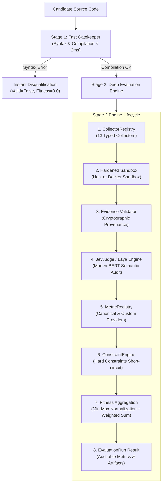

# Universal Evaluator

A typed evaluation engine that turns deterministic multi-vector evidence and remote semantic judgments into auditable, cheat-proof fitness scores for genetic programming, evolutionary search (OpenEvolve), and autonomous coding agents.

---

## Technical Documentation Suite

Comprehensive technical guides and references are organized in the [`docs/`](docs/) directory:

| Guide | Description |
| :--- | :--- |
| **[Architecture & Lifecycle](docs/architecture.md)** | Multi-stage gatekeeper pattern (<2ms fast reject), sandbox isolation, provenance verification, and constraint engine. |
| **[Operational & Usage Guide](docs/operational_guide.md)** | Integrating with `OpenEvolveBridge`, configuring `EvaluationSpec`, Docker vs Host sandboxing, and Laya environment setup. |
| **[Fitness & Custom Metrics Engineering](docs/fitness_and_custom_metrics.md)** | Writing custom metric providers, hard invariant boundaries, and Laya semantic prompt engineering (`noul`, `choice`, `score`). |
| **[Built-in Collectors Catalog](docs/collectors_catalog.md)** | Technical reference for all 13 canonical collectors (`build`, `test`, `runtime`, `benchmark`, `static`, `sql`, `security`, `gpu`, `api`, `coverage`, `dependency`, `resource`, `artifact`). |
| **[Developer Guide: Adding Collectors](docs/developer_guide_adding_collectors.md)** | Step-by-step tutorial on implementing, registering, and testing new typed collectors. |

---

## High-Level Execution Pipeline



---

## Jev / Laya Integration

The engine integrates with the remote **Laya System 1 Decision Engine** (`typed-decisions` ModernBERT-large checkpoint) via `JevJudge`. It reads `LAYA_API_KEY` from the system environment and automatically injects the candidate's Python source code and structured questions (`noul`, `choice`, `score`) into Laya's state.

```bash
export LAYA_API_KEY="sk-..."
```

---

## Verification & Test Suite

Run the complete test suite:

```bash
pytest -v
```

All 47 unit and integration tests validate typed schemas, collector sandboxing, gatekeeper short-circuits, evidence provenance, and Laya decision parsing.
