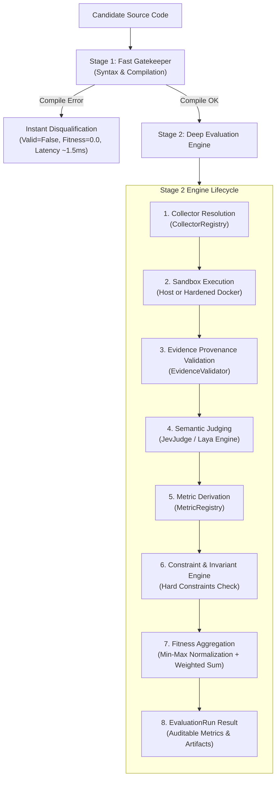
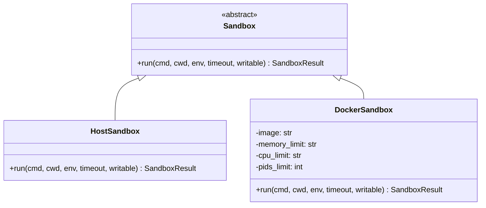
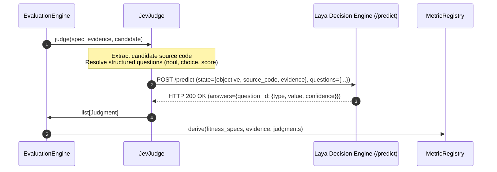

# Universal Evaluator — Architecture & Execution Lifecycle

## 1. Architectural Philosophy

Traditional evolutionary coding loops evaluate candidate programs using brittle Bash scripts or monolithic test runners. This leads to three fundamental failure modes:
1. **Fitness Leakage**: Buggy or cheating candidates receive partial fitness (e.g. 50% for passing 2 out of 4 tests), polluting the evolutionary population with defective genetic material.
2. **Resource Waste**: Candidates with trivial syntax or compilation errors consume full GPU, unit test, and benchmark cycles.
3. **Execution Insecurity**: Evolving code runs unconstrained on host hardware, risking file descriptor exhaustion, infinite loops, or malicious filesystem alterations.

The **Universal Evaluator** resolves these failure modes through an 8-stage typed architecture:



---

## 2. Multi-Stage Gatekeeper Pattern

The evolutionary loop delegates evaluation through `OpenEvolveBridge`:

### Stage 1: The Fast Gatekeeper (`evaluate_stage1`)
- **Objective**: Rapidly screen out non-viable code mutations before allocating heavy resources.
- **Checked Collector Types**: `build` and `static`.
- **Mechanisms**: Python AST parse check (`py_compile`) and workspace buildability.
- **Latency**: **~1.5 milliseconds**.
- **Behavior**: If syntax or compilation fails, the gatekeeper produces an immediate `EvaluationResult` with `valid: false`, `combined_score: 0.0`, and error artifacts. **No Docker containers are spawned, and no remote GPU judge calls are made.**

### Stage 2: Deep Evaluation Engine (`evaluate`)
- **Objective**: Execute multi-vector functional testing, performance benchmarks, and semantic audits.
- **Checked Collector Types**: `test`, `runtime`, `benchmark`, `sql`, `security`, `gpu`, `api`, `coverage`, `dependency`, `resource`, `artifact`.
- **Latency**: ~500ms to 2500ms (depending on test complexity and remote LLM/BERT inference).

---

## 3. Sandboxing & Isolation Architecture

The engine decouples evaluation logic from execution environments via the `Sandbox` abstract base class:



### The 8 Production Security Vectors of `DockerSandbox`
When evaluating untrusted code mutations generated by LLMs or genetic operators, `DockerSandbox` enforces the following container lockdown:

| # | Security Vector | Flag / Configuration | Defense Rationale |
| :- | :--- | :--- | :--- |
| **1** | **Process Zombie Defense** | `--init` | Spawns a dedicated init process (tini) to reap orphaned zombie processes. |
| **2** | **Network Air-gap** | `--network none` | Prevents data exfiltration, socket binding, or remote botnet callbacks. |
| **3** | **Immutable Root Filesystem** | `--read-only` | Root filesystem is mounted strictly read-only; candidates cannot modify OS libraries. |
| **4** | **Zero Linux Capabilities** | `--cap-drop ALL` | Strips all Linux privileges (`CAP_NET_RAW`, `CAP_SYS_ADMIN`, etc.). |
| **5** | **Privilege Escalation Block** | `--security-opt no-new-privileges:true` | Prohibits setuid binaries from escalating privileges. |
| **6** | **Non-Root Execution** | `--user 1000:1000` | Runs execution as an unprivileged user. |
| **7** | **Fork Bomb Defense** | `--pids-limit 100` | Limits total concurrent threads/processes, stopping fork bombs instantly. |
| **8** | **Strict Memory & CPU Bounds** | `--cpus 1.0 --memory 512m --memory-swap 512m` | Precludes host memory exhaustion and resource starvation. |

In addition, an isolated in-memory scratch space is mounted via `--tmpfs /tmp:rw,noexec,nosuid,size=64m`, and Python bytecode generation is disabled (`-e PYTHONDONTWRITEBYTECODE=1`).

---

## 4. Evidence Provenance & Cryptographic Verification

All raw data produced by collectors is packaged into `Evidence` records. Before metrics can be derived, the `EvidenceValidator` performs cryptographic integrity checks:

1. **Spec Hash Binding**: Computes $\text{SHA256}(\text{EvaluationSpec})$. Any runtime tampering with evaluation parameters triggers immediate validation failure.
2. **Candidate Fingerprint**: Computes a recursive $\text{SHA256}$ tree hash of all candidate source files.
3. **Collector Version Lock**: Validates that evidence collector version matches the registered descriptor version.
4. **Duplicate Prevention**: Enforces strictly unique `evidence_id` tokens per evaluation run.

---

## 5. JevJudge & Laya System 1 Semantic Engine

The engine integrates with **Laya System 1** (`typed-decisions` ModernBERT-large checkpoint) via `JevJudge`:



### Candidate Source Code Injection
`JevJudge` inspects the candidate root, reads the entrypoint file (`main.py`), and injects the raw source code into Laya's evaluation state. This enables ModernBERT to directly inspect algorithmic patterns (e.g. detecting $O(N^2)$ nested loops vs $O(N \log N)$ built-in Timsort) even when small runtime benchmarks show negligible execution time differences.

---

## 6. Constraint Engine & Fitness Aggregation

Fitness calculation follows strict mathematical aggregation:

### 1. Invariant Defense (Hard Constraints)
Every metric in `FitnessSpec` can declare a constraint boundary:
```json
"constraint": {
  "minimum": 1.0,
  "hard": true
}
```
If a metric fails a hard constraint (e.g. `test_pass_rate < 1.0`), the `ConstraintEngine` immediately executes an invariant short-circuit:
$$\text{fitness} = 0.0, \quad \text{valid} = \text{false}$$
This completely prevents defective candidates from achieving partial fitness scores.

### 2. Normalization & Weighted Sum
For valid candidates, each metric $m_i$ is normalized into $[0.0, 1.0]$ based on its `direction`:
- **Maximize**:
  $$\hat{v}_i = \frac{v_i - \min_i}{\max_i - \min_i}$$
- **Minimize**:
  $$\hat{v}_i = 1.0 - \frac{v_i - \min_i}{\max_i - \min_i}$$

The final fitness score is the weighted linear combination:
$$\text{Fitness} = \sum_{i=1}^{K} w_i \cdot \hat{v}_i, \quad \text{where } \sum_{i=1}^{K} w_i = 1.0$$
