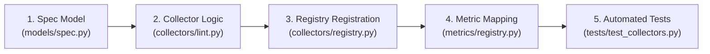

# Universal Evaluator — Developer Guide: Adding New Collectors

This guide provides a step-by-step tutorial for adding a new typed evidence collector to the Universal Evaluator. 

As a concrete example, we will implement a **Linter Collector** (`type: "lint"`) that runs `ruff` to audit Python code formatting and quality inside the sandbox.

---

## Architecture of a Collector

Every collector in the Universal Evaluator adheres to strict architectural rules:
1. **Strongly-Typed Config**: Defined as a Pydantic model registered in the `CollectorConfig` discriminated union.
2. **Deterministic Output**: Always produces `list[Evidence]` with explicit provenance (candidate fingerprint, evaluation id, collector version).
3. **Sandbox Aware**: Must invoke `self.resolve_sandbox(spec)` to ensure execution happens inside the configured container/host sandbox rather than uncontrolled host execution.
4. **Clean Code (Rule 10)**: Implementation code must be self-describing without unnecessary docstrings or inline comments.

---

## Step-by-Step Implementation



---

### Step 1: Define the Configuration Model in `src/evaluator/models/spec.py`

Subclass `CollectorConfigBase` and assign a unique literal discriminator:

```python
class LinterCollectorConfig(CollectorConfigBase):
    type: Literal["lint"]
    tool: str = "ruff"
    max_warnings: int = Field(default=0, ge=0)
    extra_args: list[str] = Field(default_factory=list)
```

Add your new configuration model to the `CollectorConfig` discriminated union in `src/evaluator/models/spec.py`:

```python
CollectorConfig = Annotated[
    Union[
        CommandCollectorConfig,
        SQLCollectorConfig,
        SecurityCollectorConfig,
        GPUCollectorConfig,
        APICollectorConfig,
        CoverageCollectorConfig,
        DependencyCollectorConfig,
        ResourceCollectorConfig,
        ArtifactCollectorConfig,
        LinterCollectorConfig,  # <-- Add here
    ],
    Field(discriminator="type"),
]
```

Also add `"lint"` to `CollectorType` at the top of `spec.py`:
```python
CollectorType = Literal[
    "build", "test", "runtime", "benchmark", "static", "sql", "security",
    "gpu", "api", "coverage", "dependency", "resource", "artifact", "lint",
]
```

---

### Step 2: Implement the Collector in `src/evaluator/collectors/lint.py`

Subclass `TypedCollector` or `EvidenceCollector`, implementing `name`, `version`, and `collect()`:

```python
import time
from uuid import uuid4
from evaluator.collectors.base import EvidenceCollector
from evaluator.models.candidate import Candidate
from evaluator.models.evidence import Evidence, EvidenceCategory, EvidenceProvenance, EvidenceStatus
from evaluator.models.spec import EvaluationSpec, LinterCollectorConfig
from evaluator.sandbox.base import Sandbox
from evaluator.sandbox.host import HostSandbox


class LinterCollector(EvidenceCollector):
    name = "lint"
    version = "1.0.0"

    def resolve_sandbox(self, spec: EvaluationSpec) -> Sandbox:
        sandbox = getattr(spec, "_sandbox", None)
        if isinstance(sandbox, Sandbox):
            return sandbox
        return HostSandbox()

    async def collect(self, candidate: Candidate, spec: EvaluationSpec) -> list[Evidence]:
        config = spec.collector_config(self.name)
        if not isinstance(config, LinterCollectorConfig):
            config = LinterCollectorConfig(id=self.name, type=self.name)

        timeout = config.timeout_seconds or spec.limits.timeout_seconds
        sandbox = self.resolve_sandbox(spec)
        cmd = [config.tool, "check", "."] + config.extra_args

        t0 = time.perf_counter()
        result = await sandbox.run(
            cmd=cmd,
            cwd=candidate.root,
            timeout_seconds=timeout,
            writable=False,
        )
        duration_ms = (time.perf_counter() - t0) * 1000

        status = EvidenceStatus.PASSED if result.exit_code == 0 else EvidenceStatus.FAILED
        value = 1.0 if result.exit_code == 0 else 0.0

        provenance = EvidenceProvenance(
            candidate_id=candidate.candidate_id,
            collector_version=self.version,
        )

        return [
            Evidence(
                id=f"e_{self.name}_{uuid4().hex[:8]}",
                collector=self.name,
                category=EvidenceCategory.QUALITY,
                status=status,
                value=value,
                duration_ms=duration_ms,
                provenance=provenance,
                metadata={
                    "exit_code": result.exit_code,
                    "stdout": result.stdout[:2000],
                    "stderr": result.stderr[:2000],
                },
            )
        ]
```

Export your collector in `src/evaluator/collectors/__init__.py`.

---

### Step 3: Register in `src/evaluator/collectors/registry.py`

Register the descriptor with its capabilities and version inside `CollectorRegistry.canonical()`:

```python
    @classmethod
    def canonical(cls) -> "CollectorRegistry":
        from evaluator.models.spec import (
            ...,
            LinterCollectorConfig,
        )
        from .lint import LinterCollector

        entries = [
            ("build", "0.1.0", {"build", "filesystem"}, CommandCollectorConfig, BuildCollector),
            ...,
            ("lint", "1.0.0", {"lint", "linter", "process"}, LinterCollectorConfig, LinterCollector),
        ]
```

---

### Step 4: Map to Canonical Metrics in `src/evaluator/metrics/registry.py`

Bind the emitted evidence to default metric names:

```python
    @classmethod
    def canonical(cls):
        return cls([EvidenceFieldProvider({
            ...,
            "lint_pass": ("lint", "value", "mean"),
        })])
```

---

### Step 5: Write Comprehensive Unit Tests in `tests/test_collectors.py`

Add tests verifying both clean and lint-failing candidate runs:

```python
@pytest.mark.asyncio
async def test_linter_collector_execution(tmp_path):
    from evaluator.collectors.lint import LinterCollector
    from evaluator.models.candidate import Candidate
    from evaluator.models.spec import EvaluationSpec

    code_file = tmp_path / "solution.py"
    code_file.write_text("x = 10\n", encoding="utf-8")

    candidate = Candidate(
        candidate_id="c_lint_test",
        root=tmp_path,
        entrypoint="solution.py",
        language="python",
    )

    spec = EvaluationSpec.model_validate({
        "evaluation_id": "test-lint",
        "objective": "Verify code linter",
        "collectors": [{"id": "lint", "type": "lint"}],
        "fitness": {"metrics": [{"id": "lint_pass", "direction": "maximize", "weight": 1.0}]},
    })

    collector = LinterCollector()
    evidence = await collector.collect(candidate, spec)

    assert len(evidence) == 1
    assert evidence[0].collector == "lint"
    assert evidence[0].provenance.candidate_id == "c_lint_test"
```

Verify with:
```bash
pytest tests/test_collectors.py -v
```
