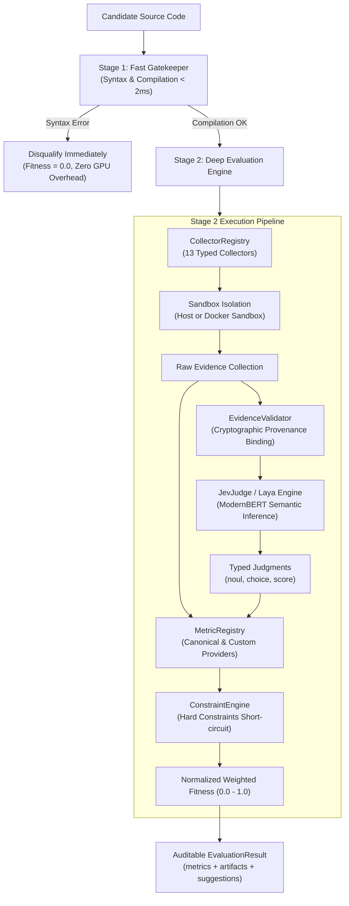

# Universal Evaluator — Technical Documentation Index

Universal Evaluator is a production-grade, typed evaluation engine designed for genetic algorithms, evolutionary code search (OpenEvolve), and autonomous coding agents. It bridges deterministic multi-vector collectors, hardware-isolated sandboxes, and remote semantic decision engines (**Laya System 1**) into auditable, cheat-proof fitness scores.

---

## Documentation Structure

| Document | Description |
| :--- | :--- |
| **[1. Architecture & Execution Lifecycle](architecture.md)** | Complete end-to-end architecture, Stage 1 Gatekeeper, Stage 2 Deep Evaluation, sandbox isolation model, provenance binding, and constraint engine. |
| **[2. Operational & Usage Guide](operational_guide.md)** | Step-by-step guide on configuring `EvaluationSpec`, running evaluations with `OpenEvolveBridge`, Docker sandboxing, and Laya environment setup. |
| **[3. Fitness & Custom Metrics Engineering](fitness_and_custom_metrics.md)** | Deep dive into designing custom fitness functions, registering custom metric providers, setting hard constraints, and configuring Laya semantic questions (`noul`, `choice`, `score`). |
| **[4. Built-in Collectors Catalog](collectors_catalog.md)** | Comprehensive technical reference for all 13 built-in collectors (`build`, `test`, `runtime`, `benchmark`, `static`, `sql`, `security`, `gpu`, `api`, `coverage`, `dependency`, `resource`, `artifact`). |
| **[5. Developer Guide: Adding New Collectors](developer_guide_adding_collectors.md)** | Step-by-step tutorial on extending the system with new typed collectors, schema discriminators, sandboxing, and test suites. |

---

## High-Level Execution Pipeline

---

## Core Guiding Principles

1. **Fail-Fast (Rule 9)**: Uncompilable candidates are rejected at Stage 1 within ~1.5ms, avoiding expensive GPU inferences or test suite executions.
2. **Zero Fitness Leakage**: Hard constraints (e.g. `test_pass_rate < 1.0`) immediately collapse fitness to `0.0` and mark the candidate `valid: false`. Cheat codes or partially working solutions cannot leak high fitness.
3. **Multi-Modal Evidence**: Combines deterministic runtime execution, unit tests, SQL validations, security audits, and neural semantic reasoning into a single auditable score.
4. **Hardware Sandbox Isolation**: Multi-vector container defenses prevent rogue evolutionary mutations from damaging the host or escaping network sandboxes.
