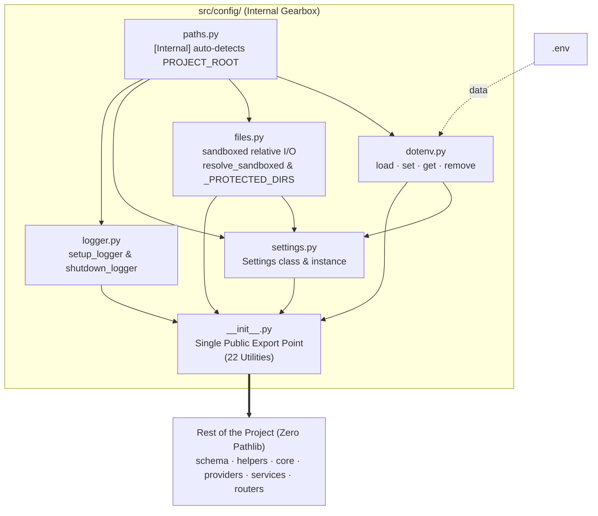

# Scaffold Config
> *"One command. Zero boilerplate. Sandboxed by design."*

Scaffolds the canonical `src/config/` layer into any Python project. This layer serves as **Layer 1 (The Single Source of Truth / Gearbox)** for all runtime configuration — environment variables, settings schemas, sandboxed file operations, and rotating loggers.

---

## 1. Architectural Philosophy: Sandboxed Relative-Path Architecture

### Why is `PROJECT_ROOT` Strictly Internal?
In traditional architectures, exposing `PROJECT_ROOT` to downstream layers (`services/`, `core/`, `routers/`, `providers/`) tempts developers to import `pathlib.Path` and perform manual path arithmetic (e.g. `PROJECT_ROOT / "data" / filename`). This introduces critical architectural vulnerabilities:
- **Scattered `pathlib` imports:** Modules become tightly coupled to raw filesystem APIs.
- **Directory Traversal Risks:** Unchecked path concatenation risks accessing files outside the project root (`../../etc/passwd`).
- **Accidental Source Destruction:** Unprotected file deletion APIs can accidentally wipe `src/`, `.git/`, or the project root itself.
- **Inconsistent Path Resolution:** Multiple layers compute paths differently, causing bugs in containerized or CLI environments.

### The Zero-Pathlib Guarantee
`src.config` completely encapsulates `PROJECT_ROOT`, `find_project_root()`, and `resolve_sandboxed()`. Downstream layers **never** import `pathlib.Path` or compute absolute paths. Instead, they interact exclusively through 22 sandboxed, relative-path functions:
1. **Relative Path Simplicity:** All functions accept clean strings relative to the project root (e.g. `"data/users/profile.json"`).
2. **Sandbox Defense (`resolve_sandboxed`):** Every path resolution verifies that the target remains within the project boundary. Attempts to traverse outside raise a `ValueError`.
3. **Protected Core Directory Guard (`_PROTECTED_DIRS`):** Writing, creating directories, or deleting within `PROJECT_ROOT`, `src/`, or `.git/` is strictly blocked by default.
4. **Escape Hatch (`get_abs_path`):** When third-party libraries require an absolute path string, `get_abs_path(rel)` returns a verified absolute string.

---

## 2. Config Layer Structure & Internal Flow

### Structure
```
config/
├── __init__.py       ← Auto-loads dotenv on import, exports all 22 public utilities
├── paths.py          ← [INTERNAL] PROJECT_ROOT auto-detection via marker files
├── files.py          ← Sandboxed file I/O, directory traversal defense, and safe deletion
├── dotenv.py         ← Safe .env loading and manipulation (setdefault semantics)
├── settings.py       ← BaseSettings schema & singleton Settings instance
└── logger.py         ← Unified Rotating File + Console Logger with shutdown hooks
```

### Unidirectional Internal Flow


---

## 3. How to Use

### Fresh Project (Safe Mode — skips existing files)
```bash
human-skills '{
    "tool_name": "setconfig",
    "tool_args": {
        "destination": "/path/to/your_project/src/config"
    }
}'
```

### Force Overwrite Existing Files
```bash
human-skills '{
    "tool_name": "setconfig",
    "tool_args": {
        "destination": "/path/to/your_project/src/config",
        "override": "true"
    }
}'
```

---

## 4. Public API Reference (The 22 Exports)

All 22 symbols are imported directly from `src.config`:

### File I/O (Sandboxed Relative Paths)
| Function | Signature | Description |
|:---|:---|:---|
| `read_text` | `read_text(rel: str, encoding="utf-8") -> str` | Reads a text file. Raises `FileNotFoundError` if missing. |
| `write_text` | `write_text(rel: str, content: str, encoding="utf-8") -> None` | Writes string to file, auto-creating parent directories. |
| `read_json` | `read_json(rel: str, encoding="utf-8") -> Any` | Reads and parses JSON file. |
| `write_json` | `write_json(rel: str, data: Any, indent: int = 2) -> None` | Serializes data to JSON with auto-created parent dirs. |
| `read_pickle` | `read_pickle(rel: str) -> Any` | Unpickles binary data from file safely. |
| `write_pickle` | `write_pickle(rel: str, data: Any) -> None` | Pickles binary data to file, auto-creating parent dirs. |
| `read_from_pos`| `read_from_pos(rel: str, pos: int = 0) -> tuple[str, int]` | Reads new content from byte offset (tailing logs/streams). |
| `get_size` | `get_size(rel: str) -> int` | Returns file size in bytes (0 if missing). |
| `get_mtime` | `get_mtime(rel: str) -> float` | Returns file last modification timestamp (0.0 if missing). |

### Path & Directory Management
| Function | Signature | Description |
|:---|:---|:---|
| `exists` | `exists(rel: str) -> bool` | Checks if a file or directory exists. |
| `is_file` | `is_file(rel: str) -> bool` | Checks if target exists and is a regular file. |
| `is_dir` | `is_dir(rel: str) -> bool` | Checks if target exists and is a directory. |
| `ensure_dir` | `ensure_dir(rel: str) -> None` | Creates directory tree if it doesn't exist. |
| `delete` | `delete(rel: str) -> None` | Safely removes a file or directory tree (guards protected dirs). |
| `list_files` | `list_files(rel: str = "", pattern: str = "*") -> list[Path]` | Glob search inside relative directory. |
| `get_abs_path` | `get_abs_path(rel: str) -> str` | **Escape Hatch:** Resolves verified absolute path string for external libraries. |

### Environment Variables (.env)
| Function | Signature | Description |
|:---|:---|:---|
| `load_dotenv` | `load_dotenv(dotenv_path=None) -> bool` | Loads `.env` using `setdefault` (auto-called on import). |
| `set_value` | `set_value(key: str, value: str) -> None` | Sets or updates a key in root `.env` and `os.environ`. |
| `get_value` | `get_value(key: str, default=None) -> str \| None` | Gets a value from `os.environ` with fallback. |
| `remove_value`| `remove_value(key: str) -> None` | Removes a key from `.env` and `os.environ`. |

### Settings & Logging
| Symbol | Type / Signature | Description |
|:---|:---|:---|
| `Settings` | `BaseProjectSettings` instance | Single Source of Truth for runtime parameters & resolved path properties. |
| `setup_logger` | `setup_logger(path, name=None, max_bytes=..., backups=...) -> Logger` | Configures standard rotating file + console logger. |
| `shutdown_logger` | `shutdown_logger(logger: logging.Logger) -> None` | Closes and removes handlers cleanly (prevents file locks). |

---

## 5. Usage Patterns for Downstream Layers

### ✅ File Operations in `services/` or `core/`
```python
from src.config import read_json, write_json, exists, ensure_dir

def save_user_profile(user_id: str, payload: dict) -> None:
    path = f"data/profiles/{user_id}.json"
    write_json(path, payload)

def load_user_profile(user_id: str) -> dict | None:
    path = f"data/profiles/{user_id}.json"
    if not exists(path):
        return None
    return read_json(path)
```

### ✅ Standard Logging in Any Layer
```python
from src.config import Settings, setup_logger

logger = setup_logger(
    Settings.LOG_DIR / "service.log",
    name="myproject.services.user"
)

logger.info("User service initialized successfully")
```

### ❌ Anti-Patterns (Forbidden)
```python
# ❌ FORBIDDEN: Direct pathlib import outside config/
from pathlib import Path
p = Path("data/profiles/user.json")

# ❌ FORBIDDEN: Trying to import PROJECT_ROOT
from src.config import PROJECT_ROOT  # PROJECT_ROOT is strictly internal

# ❌ FORBIDDEN: Using raw print() instead of logger
print("Processing started")

# ❌ FORBIDDEN: Manual .env reading
import os
key = os.environ.get("API_KEY")  # Use Settings.API_KEY instead
```

---

## 6. Architecture Auditing (Linter)

Use the built-in `linter` tool to verify complete adherence to `src.config` standards:

```bash
human-skills '{
    "tool_name": "linter",
    "tool_args": {
        "scan_path": "/path/to/your/project",
        "ignored_path": "venv, .git, tests"
    }
}'
```

### What the Linter Enforces:
- ❌ **Pathlib Violations:** Flags any `from pathlib import Path` or `import pathlib` outside `src/config/`.
- ❌ **Print Statements:** Flags any `print()` in production code.
- ❌ **Logging Compliance:** Flags unmanaged `import logging` or raw `logging.getLogger`.
- ❌ **Direct Env Access:** Flags raw `os.environ` or `os.getenv` outside `config/` or subprocess helpers.
- ℹ️ **Settings Advisory:** Validates that critical parameters are bound to `.env` variables via `Field(...)`.
