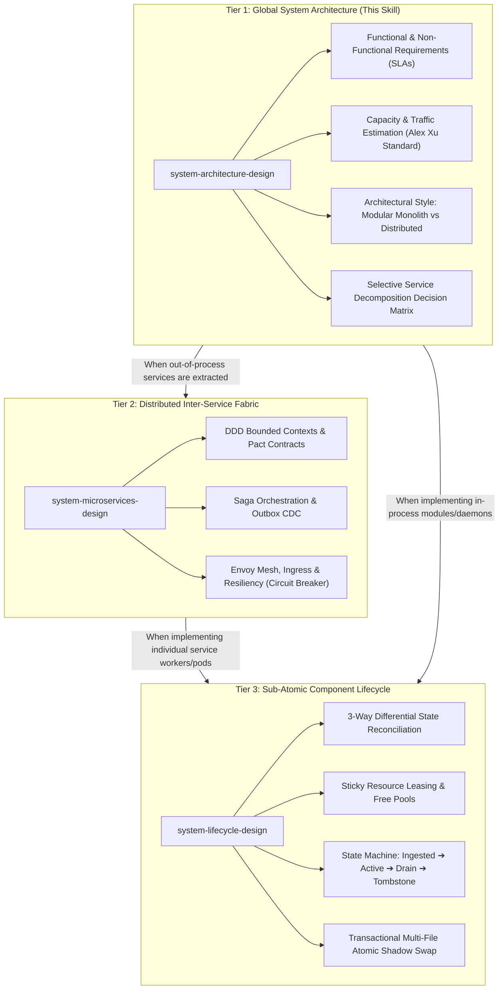
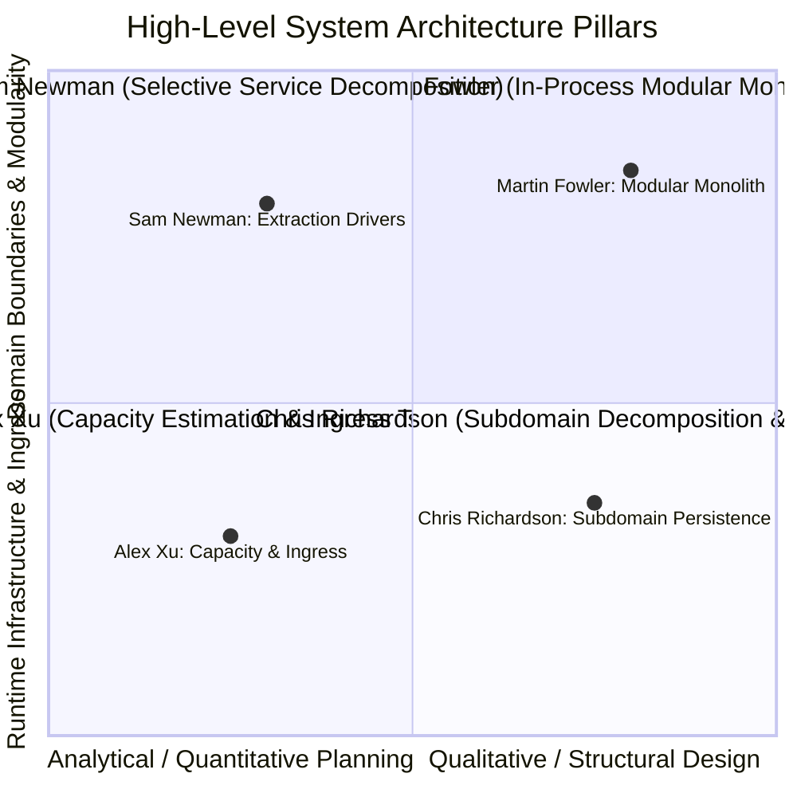
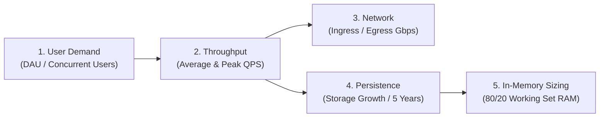
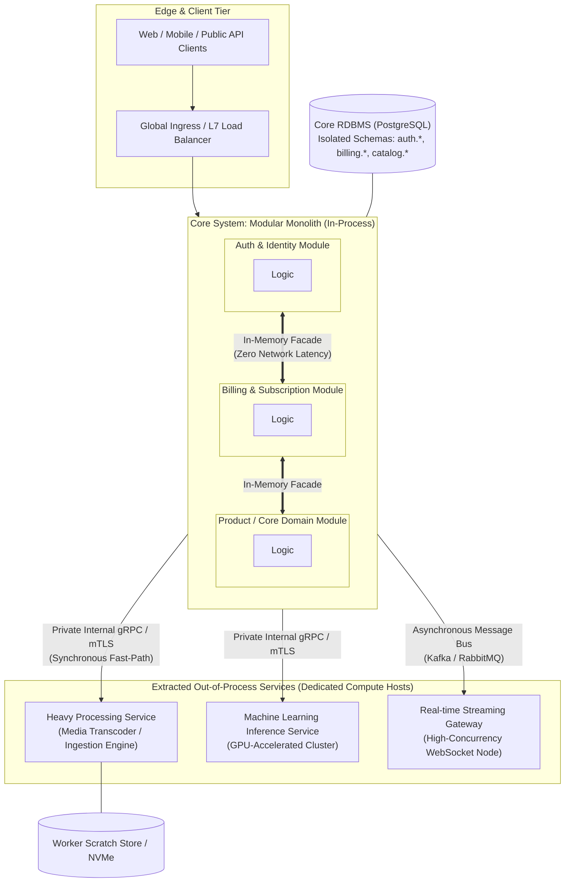
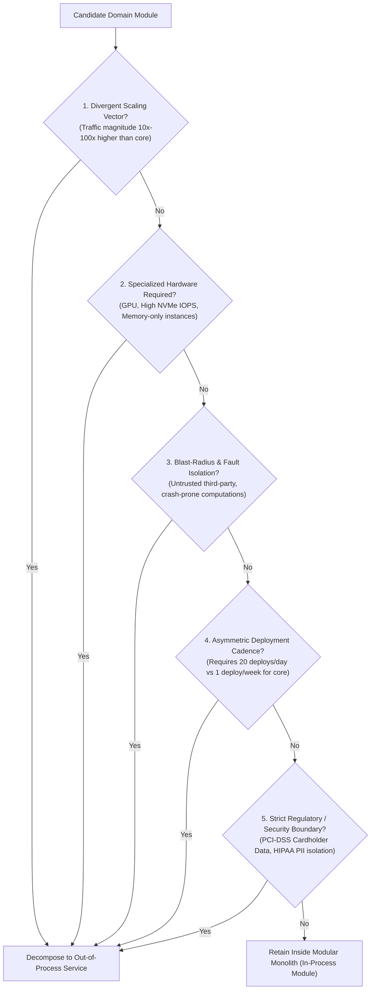
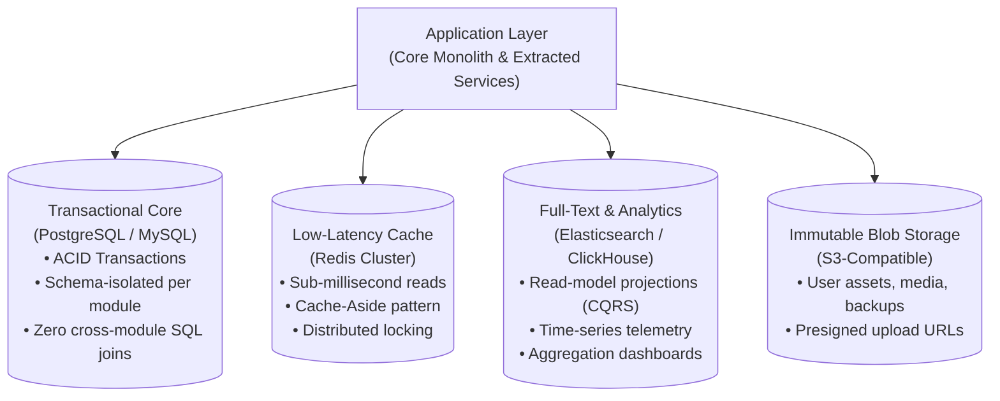

# Master System Architecture Design & Selective Decomposition Methodology

> *"Architecture is the decisions that you wish you could get right early in a project, but that are not necessarily easy to change later. A well-designed system prioritizes high-cohesion in-process modularity first, extracting out-of-process services only when concrete operational drivers demand it."*

---

## 1. Scope & Macro-Architecture Hierarchy

This skill provides the **Tier 1 Macro-Architecture Framework** for software systems engineering. It establishes the global blueprint of an application before individual service topologies or internal worker state machines are implemented.

### The 3-Tier Systems Engineering Suite:

---

## 2. Foundational Pillars of the Four Pioneers

Every high-level system architecture governed by this skill adheres to the empirical standards established by four foundational authorities:

### 1. Alex Xu — Quantitative Capacity Estimation & Multi-Tier Topology
- **Back-of-the-Envelope Estimation:** Quantitative analysis of Daily Active Users (DAU), Read-to-Write ratios, Queries Per Second (QPS), Network Bandwidth, and multi-year storage projections prior to selecting technologies.
- **Multi-Tier Edge Ingress:** Layer 4/Layer 7 load balancing, GeoDNS routing, CDN caching for static and dynamic assets, and unified API Gateway rate limiting.

### 2. Martin Fowler — Componentization & In-Process Modularity
- **Modular Monolith Priority:** Software is divided into logically distinct, high-cohesion, low-coupling modules running inside a single process boundary.
- **Encapsulated In-Process Boundaries:** Modules expose public interface contracts (Facades) and communicate in-memory. Cross-module direct table queries or private class mutations are strictly forbidden.
- **Strangler Fig Pattern:** Evolutionary migration strategy that intercepts calls to legacy boundaries and routes them to new modules or extracted services without total system rewrites.

### 3. Sam Newman — Selective Service Decomposition
- **Operational Drivers for Extraction:** Services are not extracted based on code organization; they are extracted strictly when forced by operational variance (e.g., asymmetric scaling, compute heterogeneity, independent release cycles, fault isolation).
- **Internal Private RPC:** Extracted out-of-process services communicate with the core system over dedicated private networks using high-performance, strongly-typed internal RPC protocols (gRPC / HTTP/2 multiplexing) or asynchronous event streams.

### 4. Chris Richardson — Subdomain Decomposition & Polyglot Persistence
- **Domain-Driven Subdomain Classification:**
  - *Core Domain:* Primary competitive business logic.
  - *Supporting Subdomain:* Complements the core domain (e.g., inventory catalog, notification dispatch).
  - *Generic Subdomain:* Standardized industry workflows (e.g., identity, billing, analytics).
- **Polyglot Storage Strategy:** Selecting datastores strictly aligned with data access patterns (Relational RDBMS for transactional consistency, In-Memory Key-Value for low-latency caching, Columnar for analytical aggregation, Object Store for immutable blobs).

---

## 3. Quantitative Capacity Estimation Formulation (Alex Xu Standard)

Before producing structural diagrams, compute quantitative load metrics using the standard estimation pipeline:

### Mathematical Formulation Matrix:

| Metric | Calculation Formula | Target Standard |
| :--- | :--- | :--- |
| **Average QPS** | $\text{QPS}_{\text{avg}} = \frac{\text{DAU} \times \text{Requests per User per Day}}{86,400\text{ seconds}}$ | Baseline operational traffic |
| **Peak QPS** | $\text{QPS}_{\text{peak}} = \text{QPS}_{\text{avg}} \times 2.0$ (or industry stress factor) | Infrastructure sizing boundary |
| **Read/Write Split** | Allocate based on domain profile (e.g., $90:10$ for Social/Content, $50:50$ for Financial/IoT) | Determines cache and replication strategy |
| **Network Egress** | $\text{Bandwidth} = \text{QPS}_{\text{peak}} \times \text{Average Payload Size}$ | Evaluates CDN offload and NIC constraints |
| **Storage (5 Years)** | $\text{Storage}_{\text{5yr}} = \text{Daily Writes} \times \text{Payload Size} \times 365 \times 5 \times 1.4$ (40% buffer for indexes/metadata) | Disk capacity & sharding threshold |
| **Memory Cache Size** | Apply Pareto Principle (80/20 Rule): Cache $20\%$ of daily read volume | RAM requirement for in-memory caching tier |

---

## 4. Architectural Paradigms & Structural Topology

---

## 5. Selective Service Decomposition Decision Framework

Do not decompose monolithic systems based on intuition or organizational trends. Evaluate candidate domains against the **5 Canonical Extraction Drivers** (Sam Newman & Martin Fowler standard):

### Extraction Driver Analysis Matrix:

| Driver | Description | Architectural Consequence |
| :--- | :--- | :--- |
| **Divergent Scaling** | Domain throughput exceeds core system by orders of magnitude (e.g., telemetry streaming vs account billing). | Isolates horizontal auto-scaling nodes without scaling the entire monolithic memory footprint. |
| **Resource Heterogeneity** | Domain requires non-standard hardware profiles (e.g., CUDA GPU instances, extreme memory allocations). | Prevents costly over-provisioning of monolithic host infrastructure. |
| **Fault Isolation** | High probability of unhandled crash, memory leak, or infinite loops (e.g., user-supplied scripts, video transcoding). | Protects core business uptime by containing fatal process terminations to an isolated host. |
| **Deployment Cadence** | Autonomous team requires rapid iterations without coordinating full monolithic integration testing. | Enables decoupled CI/CD pipelines and independent release schedules. |
| **Regulatory Boundary** | Stringent compliance scopes auditing to a minimal infrastructure perimeter (e.g., PCI-DSS, SOC2). | Minimizes compliance audit scope and isolates sensitive network segments. |

---

## 6. Communication Protocols & Internal API Standards

Enforce strict protocol differentiation based on the execution boundary:

| Boundary Layer | Protocol | Wire Format | Transport Security | Network Scope |
| :--- | :--- | :--- | :--- | :--- |
| **Client to Gateway** | HTTPS / HTTP/2 | JSON / REST | TLS 1.3 | Public Internet |
| **In-Process Modules** | Direct Function Call | Native Memory | In-Process Memory | Zero Network (Host RAM) |
| **Core to Extracted Service** | gRPC | Protocol Buffers (Protobuf) | Mutual TLS (mTLS) | Private VPC / Internal Subnet |
| **Asynchronous Events** | Kafka / RabbitMQ | Avro / Protobuf | SASL / TLS | Private Message Broker |
| **Real-time Push** | WebSocket / SSE | Binary / JSON | WSS (TLS) | Edge Ingress to Client |

---

## 7. Global Polyglot Storage Architecture

Data storage must be categorized by access pattern, consistency guarantee, and query complexity:

### Rules of Persistence Isolation:
1. **Logical Schema Segregation in Core RDBMS:** 
   - When running inside the core modular monolith, distinct modules share the physical database engine but maintain dedicated schemas (`auth.users`, `billing.subscriptions`, `catalog.products`).
   - Direct cross-schema SQL `JOIN` statements across module boundaries are strictly forbidden. Cross-module data queries must pass through the owning module's Public In-Process Facade.
2. **Dedicated Datastores for Extracted Services:**
   - Any out-of-process extracted service owns its private persistent datastore. Shared database access across network boundaries is prohibited.

---

## 8. The 20-Point System Architecture Audit Checklist

Before finalizing any macro-level system architecture, verify compliance against these 20 verifiable criteria:

### A. Capacity & Quantified Requirements (Alex Xu)
- [ ] 1. Functional requirements define clear inputs, processing triggers, and outputs.
- [ ] 2. Non-Functional Requirements specify explicit SLAs: Latency (p95/p99), Availability (99.9% vs 99.99%), RPO, and RTO.
- [ ] 3. Average and Peak QPS are computed from explicit DAU and read/write ratios.
- [ ] 4. Multi-year storage growth accounts for payload size, indexing overhead, and metadata buffers.
- [ ] 5. Cache memory sizing is calculated using Pareto's 80/20 working-set rule.

### B. In-Process Modularity (Martin Fowler)
- [ ] 6. Core business domains reside within a strictly decoupled Modular Monolith.
- [ ] 7. In-process modules communicate exclusively via explicit Public Interfaces/Facades or in-memory events.
- [ ] 8. Zero direct cross-module private class imports or internal repository calls.
- [ ] 9. The database enforces logical schema separation per domain module.
- [ ] 10. Cross-module SQL `JOIN` queries across domain schemas are strictly prohibited.

### C. Out-of-Process Service Decomposition (Sam Newman)
- [ ] 11. Every extracted service is justified by at least one of the 5 Canonical Extraction Drivers.
- [ ] 12. Decomposed services are deployed independently without requiring synchronized core deployments.
- [ ] 13. Core-to-service communication traverses private subnets using strongly-typed gRPC/Protobuf.
- [ ] 14. Network calls between core and extracted services enforce strict deadlines and connection timeouts.
- [ ] 15. The core system implements graceful degradation if an extracted service becomes unreachable.

### D. Data & Storage Strategy (Chris Richardson)
- [ ] 16. Persistent datastores are matched to access patterns (RDBMS, In-Memory Cache, Columnar, Object Storage).
- [ ] 17. Extracted services do not share physical database connections with the core monolith.
- [ ] 18. Complex analytical reporting is offloaded from transactional tables to specialized read replicas or search indexes.

### E. Multi-Tier Ingress & Security (Alex Xu)
- [ ] 19. Public internet traffic terminates at an Edge Ingress/Load Balancer with Token Bucket rate limiting.
- [ ] 20. Out-of-process services reside within private subnets inaccessible from the public internet.

---

## 9. Implementation Handoff to Tier 2 & Tier 3

When the macro architecture design is established:
1. **If out-of-process distributed services are defined:**
   - Delegate distributed transaction, Saga orchestration, and Envoy mesh design to **`system-microservices-design`**.
2. **When implementing code for individual workers, daemons, or modules:**
   - Delegate state reconciliation, sticky leasing, atomic file swaps, and graceful draining to **`system-lifecycle-design`**.
