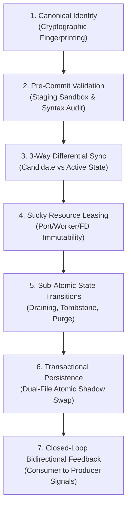
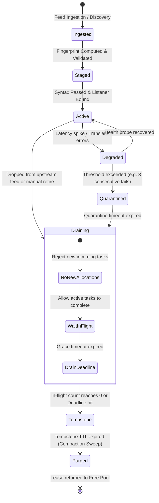

# Sub-Atomic Feature Lifecycle & Workflow Design Methodology

> *"A feature is not merely a function that executes; it is a state machine governing resources across time. True system design begins at the sub-atomic layer."*

---

## 1. Scope & Primary Directive

This skill does **NOT** design an entire software architecture or generic high-level MVP.  
Instead, it provides the exact, surgical methodology to design the **complete, end-to-end atomic and sub-atomic lifecycle for a specific, isolated functionality integration** (e.g., daemon manager, stream downloader, media transcoder, token refresher, connection pool).

Whenever an AI agent or engineer is assigned to architect or review a single functionality workflow, they must apply the **7 Invariant Pillars** defined here.

---

## 2. Leverage the `human-skills` Gateway

Before designing or implementing, consult the specialized knowledge in the `human-skills` system:

| Skill / Tool | Namespace | Purpose in Lifecycle Design |
| :--- | :--- | :--- |
| **`system-architecture-design`** | `my_skills` | Tier 1 Macro Architecture: capacity estimation, modular monolith boundaries, and selective service decomposition. |
| **`system-microservices-design`** | `my_skills` | Tier 2 Inter-Service Fabric: Saga orchestration, outbox CDC, and service mesh routing across distributed services. |
| **`human-skills`** | Gateway | Unified dispatcher to inspect available capabilities before assuming or hallucinating. |
| **`writing-plans`** | `obra_superpowers` | Structuring execution plans: exact file paths, test-driven steps, and zero placeholders. |
| **`test-driven-development`**| `obra_superpowers` | Writing the failing invariant test before touching implementation code. |
| **`linter`** | `my_skills` | AST-based architectural auditor to ensure path sandboxing, clean code, and zero forbidden imports. |
| **`mermaid_view`** | `my_skills` | Validating and rendering workflow and state-machine Mermaid diagrams. |

```bash
# Verify skills or inspect tools
human-skills --skill_info system-architecture-design
human-skills --skill_info system-microservices-design
human-skills --tool_info linter
```

---

## 3. The 7 Sub-Atomic Invariant Pillars

Every single feature integration must explicitly answer and architect these 7 dimensions:



---

### Pillar 1: Canonical Identity & Cryptographic Fingerprinting
- **The Trap:** Using human-readable names or array indices to identify managed entities.
- **The Sub-Atomic Standard:** Compute a deterministic SHA-256 fingerprint from immutable operational parameters:
  $$\text{Fingerprint} = \text{SHA256}(\text{Protocol} + \text{Resolved IP} + \text{Port} + \text{Credentials} + \text{Parameters})$$
- **Guarantee:** Eliminates duplicate endpoints masquerading under different DNS aliases or feed titles.

---

### Pillar 2: Pre-Commit Validation & Staging Sandbox
- **The Trap:** Blindly writing input data directly into production configuration files or databases.
- **The Sub-Atomic Standard:** Validate the entity **before** it touches live runtime state:
  - If a binary/daemon exists: run an offline dry-run syntax check (`<binary> -t -f staging.tmp`).
  - If schema-based: parse through strict Pydantic invariant validators.
- **Guarantee:** Invalid configurations fail fast in isolation; production execution never halts due to unverified inputs.

---

### Pillar 3: 3-Way Differential State Reconciliation
- **The Trap:** Destructive total overwrite on every sync cycle (wiping existing state and rebuilding from scratch), or concurrent reconciliation races causing split-brain.
- **The Sub-Atomic Standard:** Compute set-theoretic differential state between Candidate Ingestion ($C$) and Active Pool ($A$):
  - **Concurrency Lock:** Enforce a non-reentrant `StateLock` (or Optimistic Concurrency Control via monotonic version/generation tags e.g. `generation_id += 1`) during the diff computation so concurrent ingestion passes never interleave.
  - **Unchanged ($C \cap A$):** Retain entity and existing leases without connection disruption.
  - **Added ($C \setminus A$):** Allocate fresh resource leases from a free pool; mark `STAGED`.
  - **Modified ($C \cap A$ with mutated fields):** Hot-patch attributes while preserving operational identity.
  - **Missing ($A \setminus C$):** Do not delete abruptly! Transition to `DRAINING` state with a grace timeout.

---

### Pillar 4: Sticky Resource Leasing & Immutability
- **The Trap:** Dynamic index-based assignment (`start_port + i` or `worker_index`). When items reorder or are inserted, assigned ports/slots shift, severing active network connections.
- **The Sub-Atomic Standard:** Implement an independent `LeaseManager` backed by persistent storage:
  - Active nodes hold sticky leases.
  - Port/worker leases are locked across re-sync cycles.
  - Released resources return to a free recycling pool only after graceful expiration.

---

### Pillar 5: Sub-Atomic Node State Machine & Graceful Draining
Never restrict an entity to binary `[Active / Inactive]`. Model the complete state spectrum:



- **Tombstone TTL & Memory Recovery Sweep:**
  - To prevent memory leaks from indefinitely retaining dead entity metadata, every tombstone carries an expiration timestamp (`tombstone_until = now() + TTL`, e.g., 60s).
  - An asynchronous **compaction loop** sweeps expired tombstones into `PURGED`, unmapping configurations and returning leased ports/file descriptors back to the `LeaseManager` free pool.

---

### Pillar 6: Transactional Multi-File Atomic Persistence
- **The Trap:** Writing file A, then writing file B directly. If process crashes or disk fills between A and B, the system enters an unrecoverable **split-brain state**.
- **The Sub-Atomic Standard:** 
  1. Write all coupled files to `.tmp` staging buffers.
  2. Flush and sync (`os.fsync`).
  3. Execute atomic swap via `os.replace`.
  4. On failure, wipe `.tmp` buffers and retain previous known-good state.

---

### Pillar 7: Closed-Loop Bidirectional Feedback Contract
- **The Trap:** Producer dumps configuration; consumer reads it passively. When consumer detects a dead entity, it has no channel to alert the producer without triggering an expensive full-pipeline rerun.
- **The Sub-Atomic Standard:** Define explicit event hooks or IPC methods:
  - Consumer purges dead node $\longrightarrow$ Calls `Producer.unmap_entity(entity_id)`.
  - Producer performs **incremental unmapping**: frees the lease, updates config, and sends reload signal without fetching upstream data.

---

## 4. Canonical Workflow Document Template (`docs/workflows/`)

When documenting the lifecycle of a functionality, follow this exact structure:

```markdown
# [Component Name] Lifecycle & Workflow

## 1. Overview & Single Responsibility
[1 paragraph defining the exact boundaries: what it owns, what it isolates, what it delegates.]

## 2. Core Operational Standards & Sub-Atomic Guarantees
[Markdown Table mapping Architecture Pillars to Invariant Guarantees.]

## 3. End-to-End Workflow Diagram
[Mermaid flowchart TD tracing: Trigger -> Ingestion -> Fingerprinting -> 3-Way Diff -> Staging Syntax Check -> Atomic Swap -> Reload -> Feedback.]

## 4. Sub-Atomic Entity State Machine
[Mermaid stateDiagram-v2 mapping: Ingested -> Staged -> Active -> Degraded -> Quarantined -> Draining -> Tombstone -> Purged.]

## 5. Detailed Step-by-Step Execution Sequence
[Phased breakdown: Concurrency Locks, Deserialization, Reconciliation, Staging, Validation, Atomic Swap, Reload, Post-Reload Verification, Closed-Loop Events.]

## 6. Failure Modes, Self-Healing & Invariant Checklist
[Markdown Table detailing specific failure scenarios and their deterministic self-healing mitigations.]
```

---

## 5. Implementation Sequence for Future Agents

When implementing code from a lifecycle design:

1. **Write the Plan First:** Generate `docs/superpowers/plans/<feature>_plan.md` using the `writing-plans` standard.
2. **Execute Task-by-Task (TDD):**
   - Write failing invariant test.
   - Run test and verify exact failure.
   - Write minimal production code (zero comments, zero docstrings, token-efficient).
   - Run test and verify it passes.
3. **Audit Compliance:**
   - Run project pytest suite: ensure zero regressions.
   - Run AST linter: `human-skills '{"tool_name": "linter", "tool_args": {"scan_path": "<file_path>"}}'`.
