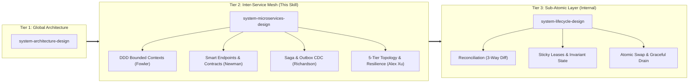
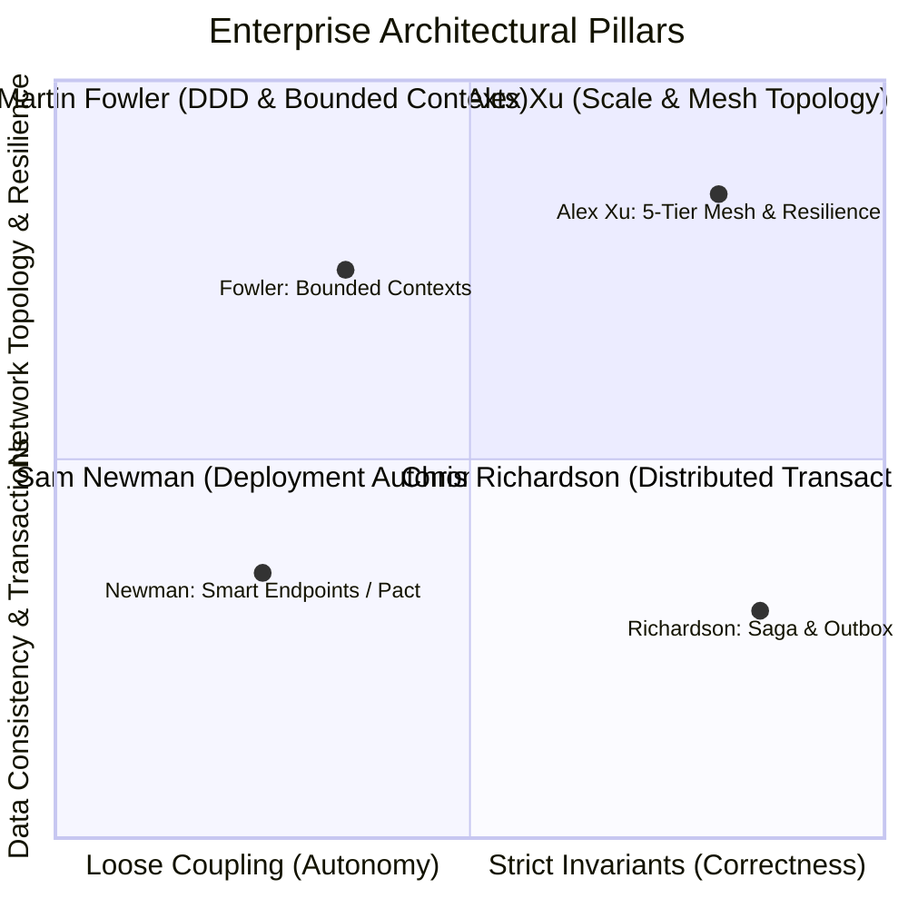
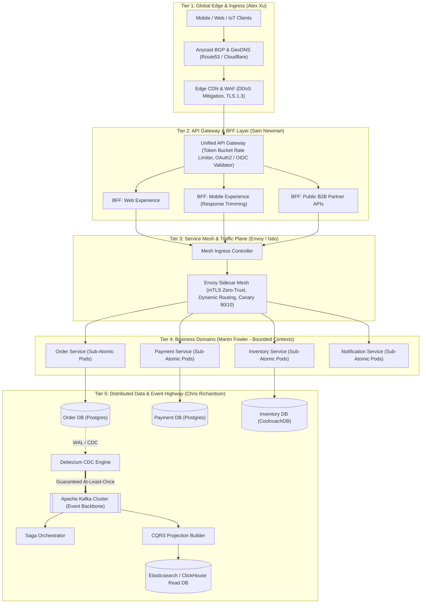
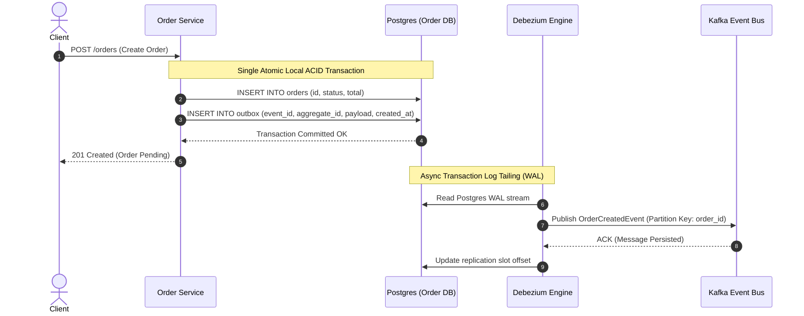
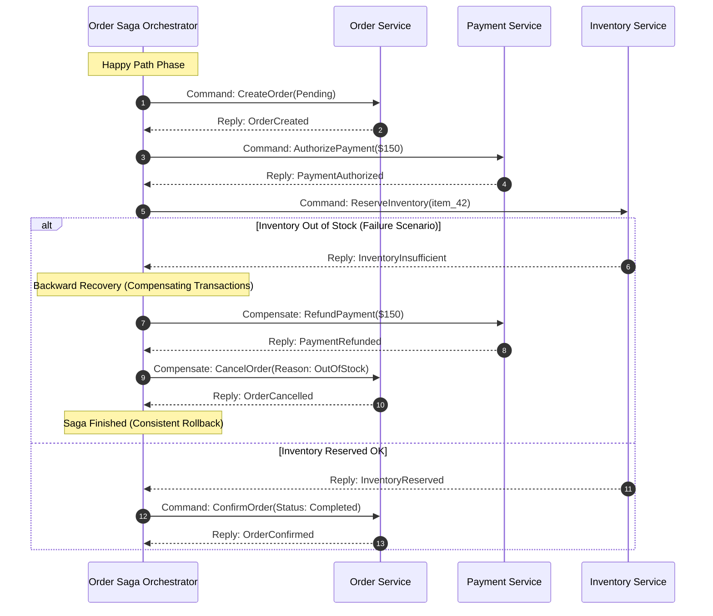
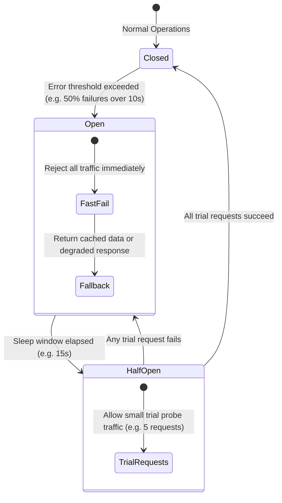

# Enterprise Microservices System Design & Orchestration Methodology

> *"A monolith fails when its code is tangled; a microservices system fails when its boundaries, transactions, and network boundaries are assumed rather than mathematically enforced. Macro-architecture governs the space between services."*

---

## 1. Scope, Philosophy & Architecture Hierarchy

This skill provides the **Distributed Inter-Service Blueprint** for orchestrating distributed microservices and decomposed out-of-process services into a cohesive, fault-tolerant, high-throughput enterprise application.

### The 3-Tier Systems Engineering Suite:


- **`system-architecture-design` (Tier 1 - The Blueprint):** Governs global capacity planning, modular monolith boundaries, and selective service decomposition.
- **`system-microservices-design` (Tier 2 - The Inter-Service Fabric):** Governs inter-service data consistency, Saga transactions, service meshes, circuit breaking, and contract enforcement across out-of-process services.
- **`system-lifecycle-design` (Tier 3 - The Brick):** Ensures every individual service, worker, daemon, or pool is internally deterministic, crash-safe, and self-healing.

---

## 2. Foundational Pillars of the Four Masters

Every enterprise microservice architecture governed by this skill must adhere to the unified principles established by the four pioneers of distributed systems:



### 1. Martin Fowler — Domain-Driven Design (DDD) & Bounded Contexts
- **Zero Universal Data Models:** Never share database tables, DTO models, or canonical classes across business boundaries. A `Customer` in the *Billing Context* (balance, cards, invoices) is fundamentally different from a `Customer` in the *Fulfillment Context* (shipping address, delivery notes).
- **Anti-Corruption Layer (ACL):** External inputs must pass through an explicit schema adapter before entering the internal domain model.
- **Strangler Fig Application:** Migrate legacy monoliths by placing an API facade in front of the monolith and strangling legacy functionality one isolated bounded context at a time.

### 2. Sam Newman — Independent Deployability & Smart Endpoints
- **The Core Microservices Test:** *“If Service A cannot be deployed to production without simultaneously deploying Service B, they are NOT microservices; they are a distributed monolith.”*
- **Smart Endpoints, Dumb Pipes:** Never embed business logic, message transformation, or routing orchestration inside message brokers or enterprise service buses (ESB). The network pipe carries dumb bytes; the services own the intelligence.
- **Consumer-Driven Contracts (Pact):** API contracts are defined by consumers and enforced in provider CI pipelines to guarantee zero breaking changes across 1,000+ services without coordination meetings.

### 3. Chris Richardson — Distributed Data & Consistency Patterns
- **Database-per-Service:** Each microservice owns its private persistent datastore. Direct cross-database joins (`JOIN` across schemas) are an absolute architectural violation.
- **Transactional Outbox + CDC:** Eliminate dual-write vulnerabilities. Microservices save business entities and an `outbox` event record within a single local ACID transaction. An asynchronous Change Data Capture (CDC) agent (e.g., Debezium) tails the database transaction log (WAL) and streams events to Kafka.
- **Saga Pattern:** Coordinate multi-service distributed transactions using choreography or orchestration with compensating transactions for rollbacks.
- **CQRS (Command Query Responsibility Segregation):** Separate mutating operations (`Commands`) from complex reporting/search queries (`Queries`) using materialized read projections.

### 4. Alex Xu — High-Scale Topology, Resilience & Rate Limiting
- **Layered Ingress Topology:** Edge DNS $\rightarrow$ Anycast BGP $\rightarrow$ CDN/WAF $\rightarrow$ L4/L7 Load Balancers $\rightarrow$ API Gateway $\rightarrow$ Backend-for-Frontend (BFF) $\rightarrow$ Service Mesh (Envoy sidecars).
- **Graceful Degradation & Resilience:** Circuit Breakers (prevent cascading deadlocks), Bulkhead Pools (isolate resource exhaustion), and Exponential Backoff with Full Jitter (prevent thundering herd).
- **W3C Distributed Tracing:** OpenTelemetry distributed context propagation across every RPC boundary to make 10,000 service hops observable on a single dashboard.

---

## 3. High-Scale 5-Tier Enterprise Topology

This reference topology defines how user requests travel from global client devices down to thousands of internal microservices:



---

## 4. Communication Protocol Decision Matrix

Do not standardize on a single communication protocol for all interactions. Apply the correct protocol based on the transactional nature of the payload:

| Interaction Style | Recommended Protocol | Data Format | Latency Target | Use Case |
| :--- | :--- | :--- | :--- | :--- |
| **External Client to Gateway** | HTTPS / HTTP/2 | JSON / REST | < 100 ms | Public mobile/web clients, browser compatibility |
| **Internal Sync Inter-Service** | gRPC (HTTP/2 multiplexing) | Protocol Buffers (Protobuf) | < 5 ms | High-throughput, strongly-typed internal RPCs |
| **Async Domain Events** | Apache Kafka / Apache Pulsar | Avro / Protobuf (Schema Registry) | Asynchronous | State changes, Saga triggers, Outbox CDC, auditing |
| **Ultra-Low Latency Pub/Sub** | NATS Core / JetStream | Binary / JSON | < 1 ms | Ephemeral signals, cache invalidations, live chat |
| **Streaming / Real-Time Client** | WebSocket / SSE | JSON / MsgPack | Persistent | Live order tracking, notifications, financial tickers |

---

## 5. Distributed Data Patterns & Zero-Data-Loss Standards

### Pattern A: Transactional Outbox + Change Data Capture (CDC)
**The Problem:** Writing to a SQL database and then publishing to Kafka in application code causes the **Dual-Write Hazard**. If the app crashes after database commit but before Kafka send, messages are permanently lost. If it sends to Kafka first and DB fails, ghost events trigger corrupted downstream workflows.

**The Solution:**


---

### Pattern B: The Saga Pattern (Distributed Transactions Without 2PC)
When a business operation spans multiple services (e.g., E-Commerce Checkout), use an **Orchestrated Saga** with strict compensating rollbacks:



---

## 6. Fault Isolation & Resiliency Engineering (Alex Xu Standard)

In a system of 1,000 microservices, if each service boasts 99.9% availability ($0.999$), overall system availability is $0.999^{1000} \approx 36.7\%$. **Failure is not an exception; it is the constant operational state.**

### 1. Circuit Breaker State Transition Pattern
Wrap all inter-service outbound calls in a Circuit Breaker (e.g., Resilience4j / Envoy circuit breaking):



### 2. Bulkhead Isolation
Isolate internal execution resources so that a latency surge in a non-critical downstream service (e.g., Recommendation Engine) cannot starve resources needed for critical paths (e.g., Payment Gateway):
- **Thread Pool Bulkheads:** Dedicated thread pool per downstream service.
- **Connection Pool Bulkheads:** Capped maximum connections per database and per gRPC target host.

### 3. Exponential Backoff with Full Jitter
Never execute immediate or uniform retries across distributed clients:
$$T_{\text{sleep}} = \text{random}(0, \, \min(T_{\text{max}}, \, T_{\text{base}} \times 2^{\text{attempt}}))$$
*Full Jitter eliminates synchronized retry waves that trigger devastating Thundering Herd cascades on recovering services.*

---

## 7. Global Observability & Distributed Tracing Contract

Every microservice must propagate the **W3C Distributed Trace Context** across all network boundaries:

```ini
traceparent: 00-4bf92f3577b34da6a3ce929d0e0e4736-00f067aa0ba902b7-01
              │  └────────────────┬───────────────┘ └───────┬──────┘ └─┬┘
           version             trace_id                  parent_id   flags (01=sampled)
```

### The 4 Golden Signals Contract (Google SRE Standard):
Every service must expose structured Prometheus metrics:
1. **Latency:** Duration of request execution (histogram in milliseconds: p50, p95, p99).
2. **Traffic:** Demand placed on the service (HTTP requests/sec or gRPC calls/sec).
3. **Errors:** Rate of failed requests (HTTP 5xx or gRPC codes $\neq 0$).
4. **Saturation:** Utilization of memory, CPU, socket file descriptors, and database connection pools.

---

## 8. The 20-Point Enterprise Architectural Audit Checklist

Before declaring any enterprise microservice architecture ready for production, verify compliance against this checklist:

### A. Domain & Boundaries (Fowler)
- [ ] 1. Every microservice maps directly to an explicit DDD Bounded Context.
- [ ] 2. Zero shared database tables or cross-schema database queries.
- [ ] 3. Anti-Corruption Layers (ACL) sanitize all foreign upstream payloads.
- [ ] 4. Domain entities represent business workflows, not database CRUD rows.

### B. Deployment & Autonomy (Newman)
- [ ] 5. Every service has its own dedicated CI/CD pipeline and can release independently.
- [ ] 6. Zero shared code libraries containing mutable domain logic (utility libs only).
- [ ] 7. Consumer-Driven Contracts (Pact) execute automatically on every PR.
- [ ] 8. Message pipes are dumb; no business logic lives inside Kafka brokers or queues.

### C. Data & Transactions (Richardson)
- [ ] 9. Every state mutation publishing an event utilizes the Transactional Outbox + CDC pattern.
- [ ] 10. Multi-service transactions execute via Saga Orchestrators with verified compensating actions.
- [ ] 11. Consumers enforce strict idempotency (checking event ID before mutating state).
- [ ] 12. Complex cross-service search queries are offloaded to dedicated CQRS read projections.

### D. Topology & Resilience (Alex Xu)
- [ ] 13. Public traffic enters through an Edge API Gateway with Token Bucket rate limiters.
- [ ] 14. Mobile and Web clients access the system through dedicated Backend-for-Frontend (BFF) layers.
- [ ] 15. All inter-service calls traverse an Envoy sidecar service mesh with mutual TLS (mTLS).
- [ ] 16. Outbound RPC calls are guarded by Circuit Breakers with configured fallbacks.
- [ ] 17. Retries strictly enforce Exponential Backoff with Full Jitter.
- [ ] 18. Thread pools and connection pools are isolated using the Bulkhead Pattern.

### E. Sub-Atomic Invariant Compliance (Antigravity Standard)
- [ ] 19. Individual service workers and daemons strictly implement the 7 Invariant Pillars of `system-lifecycle-design`.
- [ ] 20. W3C `traceparent` context is forwarded across 100% of HTTP, gRPC, and Kafka boundaries.
